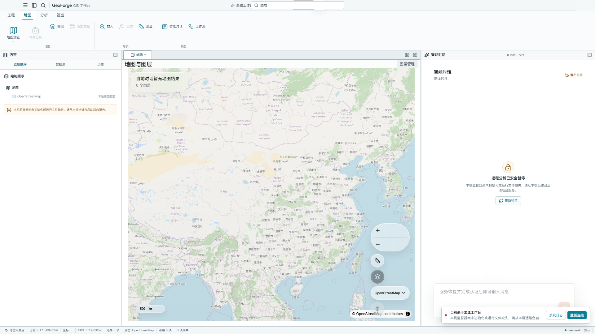
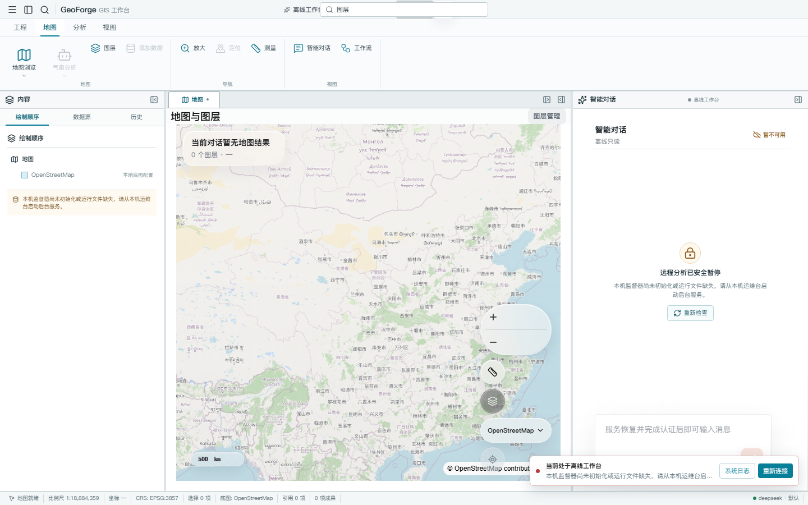
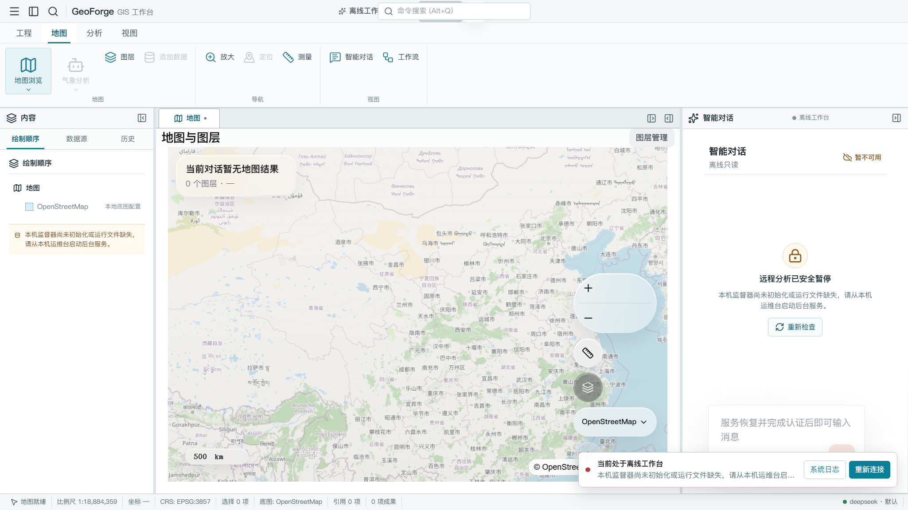
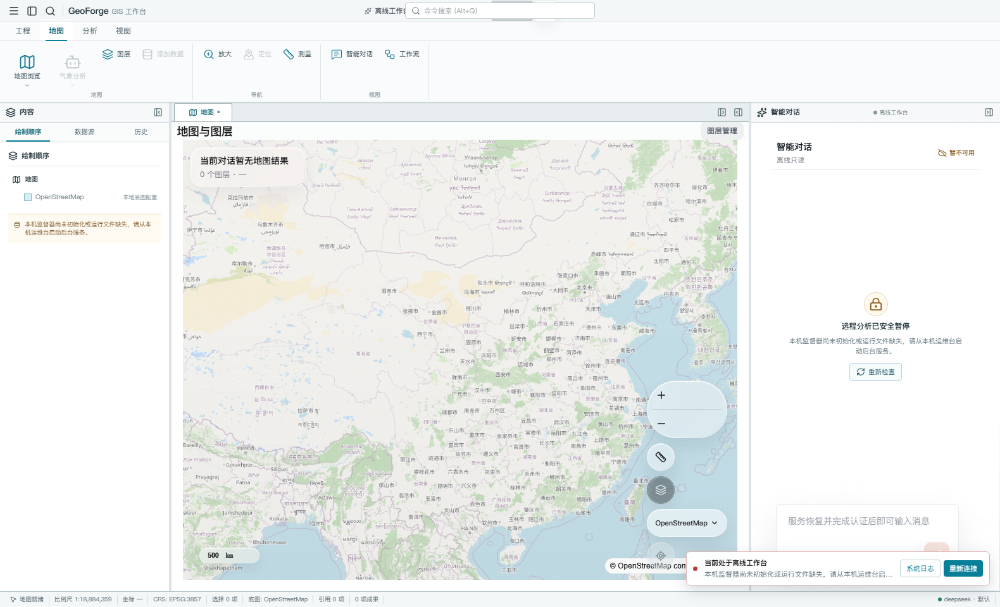

# geo-agent-platform

中文优先的 GIS Agent 平台。Node/TypeScript Server 承载 Agent 运行时、WebSocket 控制面和 HTTP 数据面；Python Worker 只承载 `gis_meteorology` 科学计算；Electron + React + MapLibre 提供 Windows 优先的桌面 GIS 工作台。

## 桌面工作台预览

1920×1080 工作台：



1440×900 紧凑布局：



1366×768、Windows 150% 缩放：



离线启动与自动认证恢复状态：



其它分辨率、文件哈希和验收说明见 [桌面视觉验收材料](artifacts/desktop-acceptance/README.md)。

## 架构

- `apps/server/`：Hono HTTP 数据面、`/ws` WebSocket 控制面、Agent runtime、ToolProvider 注册与 PostgreSQL 会话事实
- `apps/desktop/`：Electron 桌面工作台；Main 独占认证、HTTP/WS、文件、导出和窗口生命周期，Renderer 只使用受约束 IPC
- `apps/worker/`：无状态 Python 科学计算 Worker，不保存 session/thread/run
- `PostgreSQL/PostGIS`：用户、权限、Session、Thread、Run、Transcript、Workflow、Artifact 元数据、运行配置、工具目录与空间数据的结构化事实源
- `runtime/objects/sha256/`：上传内容、Artifact 二进制、SDK checkpoint 和 Markdown 记忆正文等大载荷的内容寻址存储；数据库保存引用与生命周期
- `runtime/conversations/`：只保存附件审计和 Agent 诊断载荷，不保存 Session、Run 或 Transcript 的第二份结构化事实
- `runtime/uploads/files/`：通用线程文件的本地索引，文件正文统一引用内容寻址对象

HTTP 只保留 `/health`、文件/图层上传替换、artifact 元数据/GeoJSON/下载和底图资源。会话、线程、运行、工具、配置、文件目录和图层目录命令统一使用 `/ws`。

## 气象工具

气象分析从通用线程文件开始，后续工具只消费当前 run 中的 `valueRef`。Worker 只接受共享 `RUNTIME_ROOT` 内的相对文件引用，拒绝绝对路径和越界路径。

完整工具链覆盖数据检查、模型解读、栅格渲染、统计、阈值区域、等值线、DOCX 报告，以及短时临近预报序列检查、降水分析、问题回答、预报文本和栅格渲染。

## 本地开发

### Windows 一键启动

首次运行建议安装 `.node-version` 指定的 Node.js 24 LTS（当前为 24.14.0）；项目同时支持 Node.js 22.13 及以上的 Node 22 LTS，以及 Node.js 24 及后续版本。Node 23 不在当前 Vitest 依赖声明的支持范围内。复制 `.env.example` 为 `.env` 并执行 `npm install`。Supervisor 只管理 `infra`、`worker` 和 `api` 三个后台服务；Electron 是本地交互应用，不作为后台服务监督。

```powershell
.\GeoForge.ps1
.\dev.ps1 desktop
.\dev.ps1
.\dev.ps1 restart -Service api
.\dev.ps1 status
.\dev.ps1 logs -Service api -Tail 100
.\dev.ps1 logs -Service all -LogLevel error -IncludeSupervisor
.\dev.ps1 agent
.\dev.ps1 agent -AgentPrompt "杭州明天会下雨吗？"
.\dev.ps1 agent -Check
.\dev.ps1 restart
.\dev.ps1 stop
```

`GeoForge.ps1` 是面向日常使用和演示的一键入口：它按 `package.json` 的引擎范围选择已安装的 Node 22 LTS 或 Node 24 以上版本，复用 `dev.ps1 desktop` 装配本机安全配置、启动 Supervisor，并立即进入桌面工作台；Renderer 不等待后端才挂载，三项原生后台服务会在旁路恢复。也可以使用 `npm run desktop:windows`、`npm run dev:windows:status` 和 `npm run dev:windows:stop`。关闭桌面窗口不会停止后台服务；使用 `.\dev.ps1 shutdown` 才会停止三项后台服务并关闭 Supervisor。

`agent` 会打开无需输入平台账号密码的本机 Agent 终端。它使用操作系统 ACL 保护的本机根密钥建立短期、仅 loopback 可用的保留服务主体，并复用主 API 的 Agent Runner、工作流、审批和会话事实源。使用说明见 [GeoForge 本机 Agent CLI](docs/operations/local-agent-cli.md)。

### Bash / macOS / Linux

```bash
cp .env.example .env
npm install
./dev.sh
./dev.sh desktop
./dev.sh agent
./dev.sh agent --prompt "杭州明天会下雨吗？"
```

PostgreSQL/PostGIS、Python 科学计算 Worker 与 Node Server 全部作为宿主机原生进程运行，无需容器运行时。矢量瓦片由 Node 调用 PostGIS 的固定 MVT 函数生成，GeoTIFF 栅格瓦片由 TypeScript 服务使用 GeoTIFF.js 与 sharp 本地渲染，不再运行独立地图服务。桌面 Renderer 会立即挂载；Supervisor 和后端在旁路恢复，因此后端尚未就绪时仍能进入离线工作台并查看本机系统日志。`./dev.sh desktop` 与 `.\dev.ps1 desktop` 不会以同步等待后端的方式阻塞 Electron 窗口。

主要配置为 `API_HOST`、`API_PORT`、`WORKER_URL`、`DATABASE_URL`、`RUNTIME_ROOT`、`ENABLED_TOOL_PROVIDERS` 和 `DEVELOPER_TOOL_ALLOWED_ROOTS`。安装到仓库的 Provider 不会自动启用。`geo-platform-developer-tools` 只用于维护 GeoForge GIS/气象 Agent，必须显式配置允许访问的绝对根目录；缺失时 Provider 会在 DebugPage 显示不可用原因。

开发数据结构变更后使用 `npm run reset:conversations` 显式清空旧会话、上传、artifact 与对象文件。该命令保留 PostGIS 图层、工具目录和运行配置，不做旧 payload 兼容回填。

## 验证

```bash
npm run build
npm test
npm run lint:desktop
npm run test:e2e
pytest -q
```

生产环境由 WinSW/systemd 托管 Supervisor，并由同一监督器管理三个固定原生后台服务；桌面应用通过 Main 进程连接本机 API，不提供公开浏览器产品入口或匿名分享 URL。
