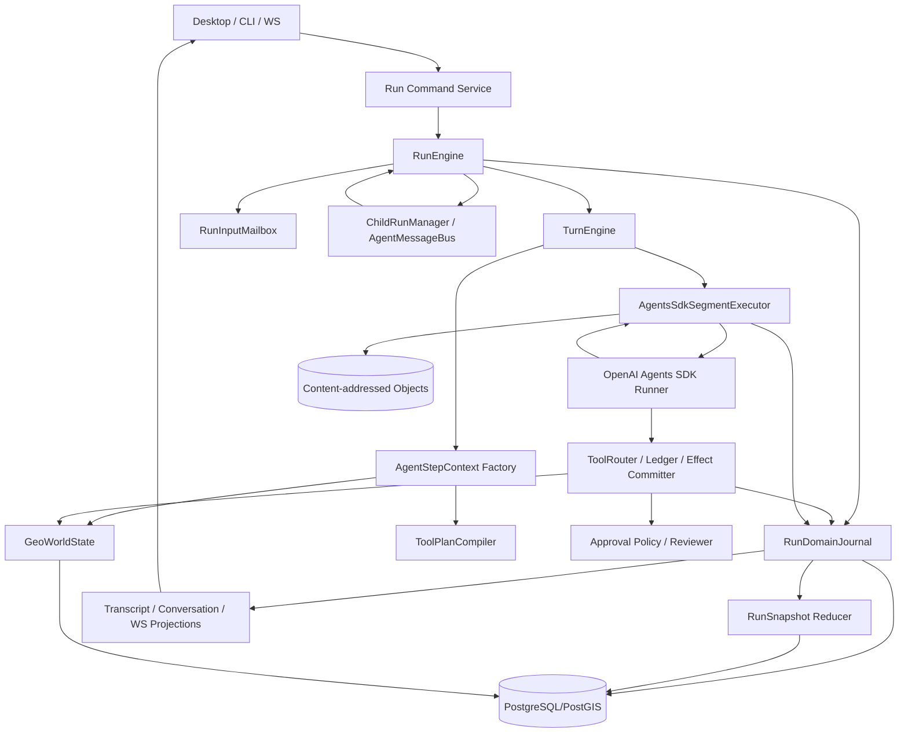

# Newmap Codex 风格 Agents SDK 运行时完整重构计划

> 本文是面向 Codex 执行的架构 RFC、迁移手册和逐 PR 验收清单。
>
> **状态**：In progress（WP-00 至 WP-10 已完成；下一包为 WP-11）
>
> **Newmap 基线**：`JamesLinYJ/Newmap@ffa50bbe1bd0e8de82f7f40448bafbe3f1eb751a`
>
> **Codex 参考基线**：`openai/codex@4a7b51c560aaef0a89298272d3fff1aefe3dd666`
>
> **当前 SDK**：`@openai/agents@0.17.0`
>
> **已验证目标 SDK**：`@openai/agents@0.17.0`；后续升级仍只能在兼容性契约测试通过后落地。
>
> **执行原则**：每次 Codex 任务只实施本文一个 Work Package，不跨包顺手重写，不以“文件已移动”代替架构完成。

---

## 0. 如何使用本文

本文既不是一次性讨论稿，也不是要求在一个 PR 中完成的“大重写”。正确用法是：

1. 先阅读根目录 `AGENTS.md`、`docs/architecture/overview.md` 和本文。
2. 选择一个尚未完成且依赖已经满足的 Work Package。
3. 在修改前重新检查当前仓库事实；本文中的文件名和结构是目标，不是替代代码阅读的真相。
4. 在一个分支、一个 PR 内完成该 Work Package 的代码、迁移、测试、文档和旧路径删除。
5. 用本文给出的验收项逐条提交证据。
6. 不得通过兼容别名、双写、吞错、默认成功或长期 feature flag 掩盖未完成迁移。

本文引用 Codex 的**行为设计和边界**，不要求复制其 Rust 目录、类型名或协议。若直接复用 Apache-2.0 代码，必须保留上游许可证和归属；默认优先做行为级适配。

---

## 1. 执行摘要与最终决策

### 1.1 最终架构决策

Newmap 采用 **Codex-inspired, Agents-SDK-native** 架构：

- **Newmap 拥有持久控制面**：Run、Turn、Step、输入邮箱、目标版本、领域事件、GeoWorldState、工具副作用账本、审批持久化、子运行、投影与恢复策略。
- **OpenAI Agents SDK 拥有单个执行段内部循环**：Agent、Runner、模型调用、function tool、handoff、Agent-as-tool、流式事件、guardrail、MCP、hosted tool、SandboxAgent 和公开 RunState 中断恢复。
- **Newmap 不手写原始 Responses 循环**，不复制 SDK 已经实现的模型—工具—handoff 微循环。
- **Newmap 不再依赖 SDK 私有字段和序列化内部布局**，包括 `_originalInput`、`generatedItems` 或其它未公开结构。
- 一个根 Run 可以拥有多个持久 child Run；每个 Run 在任一时刻最多有一个活动 Runner 执行段。禁止同一个 Run 中存在两个互相竞争的 Runner。

### 1.2 为什么不是继续给现有 Runtime 打补丁

当前实现已经拥有 checkpoint、steering、approval、workflow、goal judge、sub-agent、MCP、skill、sandbox、上下文压缩和工具恢复账本，功能不弱。问题在于同一语义分散在多个可变状态中：

```text
SDK RunState
  + AgentState
  + canonical Transcript
  + FileAgentsSession
  + ConversationItem
  + run_inputs
  + tool recovery ledger
  + UI RunEvent
```

现有代码通过 callId、entryId、itemId、input sequence、marker、checkpoint cursor 和投影补偿维持一致性。继续增加功能会让恢复、并发、steering、子 Agent 和 SDK 升级风险非线性上升。

本次重构的根目标不是“更多功能”，而是：

> 每类事实只有一个所有者；每个模型请求、工具调用和世界变化都能从持久语义记录重建；SDK 只通过公开接口接入。

### 1.3 必须先修正的工程标准

当前 `AGENTS.md` 将 SDK Runner 定义为单次 run 的唯一编排状态机，并禁止平台拥有 turn loop 或并行 Runner。这个规则适合当前实现，但会阻止持久 child Run、StepContext、输入邮箱和 Codex 风格控制面的落地。

Work Package 00 必须先把规则改为：

- SDK Runner 是**单个 Run 执行段内部**唯一的 Agent 微循环。
- Newmap RunEngine 是持久 Run/Turn/Step 生命周期和多执行段的唯一控制面。
- 同一 Run 不得并行启动多个 Runner；不同 child Run 可以在根控制面限额内并发。
- SDK RunState 是 SDK 执行段恢复载荷，不是平台全部领域事实。
- PostgreSQL 领域事件和快照是平台恢复、审计和投影事实源。

在这条标准修改合入前，不得开始核心代码重构。

---

## 2. 目标、非目标与硬不变量

### 2.1 目标

1. 使用 Agents SDK 公开能力实现 Codex 风格的 Run/Turn/Step 控制面。
2. 支持运行中 steering、澄清、审批和模型/能力切换，且可恢复、可审计。
3. 把地图、图层、数据集、artifact、valueRef 和权限组织为版本化 `GeoWorldState`。
4. 把工具发现、曝光、路由、并发、审批、副作用提交和投影拆为独立边界。
5. 支持三种多智能体模式：`Agent.asTool()`、`handoff()`、持久 child Run。
6. 支持 Codex 式 StepContext、WorldState diff、input mailbox、tool search、hooks、skills、plugins、MCP refresh、compaction 和预算治理。
7. 消除 SDK 私有字段依赖，并建立 SDK 升级兼容测试。
8. 保持 PostgreSQL/PostGIS、内容寻址对象存储、RBAC、审计和 `valueRef` 事实边界。
9. 保持 Windows-first 产品定位；无可用 sandbox backend 时必须明确禁用危险能力，不能伪装隔离成功。
10. 每个迁移阶段都可验证、可回放、可安全停留，不要求一次性切换全部功能。

### 2.2 非目标

- 不把 Codex Rust runtime 作为 Newmap 运行依赖。
- 不复制 Codex CLI、IDE、Git、LSP、补丁 UI 或代码审查产品形态。
- 不绕过 Agents SDK 直接手写 OpenAI Responses function-call loop。
- 不让模型直接写 PostgreSQL、PostGIS 或宿主文件。
- 不让 Hook、Skill、Plugin、MCP 或 child Agent 绕过 RBAC、审批、路径沙箱和审计。
- 不为兼容历史 payload 保留长期双事实源；开发数据允许通过现有重置流程做一次性切换。
- 不强行给 DeepSeek Chat Completions 宣称 Responses、native deferred tool、hosted tool 或服务端 compaction 能力。
- 不把所有 Codex 功能都照搬；只有能提升 GIS 用户结果、运行可靠性或扩展性的能力进入产品核心。

### 2.3 硬不变量

| 编号 | 不变量 |
|---|---|
| I-01 | PostgreSQL/PostGIS 是结构化 Run、领域事件、Workflow、Approval、World revision、工具账本和 child Run 的唯一事实源。 |
| I-02 | 内容寻址存储只保存大载荷、精确模型输入快照、SDK checkpoint、摘要和 artifact 内容；数据库保存引用、哈希和生命周期。 |
| I-03 | 同一 Run 任一时刻最多一个活动 Agents SDK Runner 执行段。 |
| I-04 | SDK 私有字段、未公开 JSON 字段和内部 class 属性不得进入平台业务代码。 |
| I-05 | 模型调用允许在崩溃恢复时重试；有副作用工具不得因恢复自动重复执行。未知副作用必须进入 `requires_action`。 |
| I-06 | 工具结果、GeoWorldPatch、artifact、valueRef 和工具账本终态必须原子提交。 |
| I-07 | 模型看到的工具目录、权限、MCP、sandbox、skills 和 world revision 必须来自同一个不可变 StepContext。 |
| I-08 | Transcript、ConversationItem、RunEvent 和桌面状态是投影，不能反向决定执行事实。 |
| I-09 | 任何 provider 能力都从 capability snapshot 判断；不以名称猜测，不静默降级。 |
| I-10 | Context 压缩不得拆散 function call/result、approval、reasoning 配对或当前输入。 |
| I-11 | Child Run 有独立 checkpoint、mailbox、预算和取消边界；取消 child Run 不得误取消 root Run。 |
| I-12 | 每个架构边界必须有失败路径测试、重放测试和真实链路证据。 |

---

## 3. Codex 能力到 Newmap 的适配矩阵

| Codex 参考 | Codex 中的作用 | Newmap 适配 | Agents SDK 基础 |
|---|---|---|---|
| `session/turn.rs` | 持有 turn 生命周期、pending input、采样后续和 compaction | `RunEngine + TurnEngine` 持有持久外层生命周期；不复制原始模型 loop | `Runner.run()` 作为执行段 |
| `session/step_context.rs` | 每次模型请求不可变环境、模型、审批、MCP、工具快照 | `AgentStepContext` | `RunContext`、动态 instructions、model input hooks |
| `session/world_state.rs` | 把环境、权限、工具、插件、时间等组成模型世界状态 | `GeoWorldState + GeoWorldDiff` | system/developer input、RunContext |
| `session/input_queue.rs` | 活动 turn steering 与 agent mailbox | 持久 `RunInputMailbox` 和 `AgentMessageBus` | `sessionInputCallback`、`callModelInputFilter` |
| `tools/router.rs` | 模型可见工具与实际 handler 使用同一 router | `ToolPlanCompiler + ToolRouter` | function tools、MCP tools、hosted tools |
| `tools/spec_plan.rs` | 每 step 编译工具计划、曝光、deferred tool | provider-aware capability plan | SDK tool search、`deferLoading`、namespace；非 Responses 用分段重装配 |
| `tools/parallel.rs` | 并行安全工具共享锁，写工具独占，统一取消 | `ToolExecutionGate` | SDK function tool concurrency + 平台读写闸门 |
| `tools/approvals.rs` | 中央审批动作、策略、reviewer、缓存键 | `ApprovalPolicyEngine + ApprovalAction` | SDK interruptions、`needsApproval`、公开 approval hooks |
| `tools/sandboxing.rs` | 权限 profile、sandbox attempt、升级与 denied-read 保留 | `SandboxPolicy + SandboxBackend` | `SandboxAgent`、Manifest、SDK sandbox client |
| `compact.rs` | 预/中 turn compaction、world reinjection、窗口 rollover | `ContextWindowManager` | `callModelInputFilter`、Session、摘要模型 |
| `agent/control.rs` | 根作用域多 Agent 控制、消息、取消、限额 | `ChildRunManager` | 每个 child Run 使用自己的 Agent/Runner |
| `multi_agents_v2/*` | spawn/send/wait/interrupt/list、fork history | child Run 工具面与消息总线 | Agent-as-tool/handoff 继续用于短任务 |
| `hook_runtime.rs` | session、prompt、tool、permission、stop、compact hooks | 受信任 `RuntimeHookRegistry` | SDK guardrails/lifecycle + 平台 hooks |
| `skills.rs` | 显式/隐式 Skill 调用和作用域 | GIS Skill snapshot 与 invocation ledger | Sandbox skills / instructions |
| `plugins/*` | 能力包、显式提及、注入和 connector 绑定 | `CapabilityPluginRegistry` | MCP、tools、skills 的组合注册 |
| `session/mcp.rs` | 按 step 解析、刷新和绑定精确 MCP catalog | `McpRuntimeManager` | SDK MCP server/client |
| rollout/token budget | 根与子 Agent 总预算 | `RunBudget + RootBudget` | SDK usage、模型 usage |
| turn diff tracker | 跟踪工作区变化 | `GeoWorldDiff` | 工具 effects 和 artifact ledger |

### 3.1 明确不照搬的 Codex 能力

以下能力只在开发者维护模式按需使用，不进入普通 GIS Agent 核心：

- Git patch、apply_patch、代码审查、worktree、LSP 和 IDE 集成。
- Codex 专属加密参数、账户计划、Guardian 服务实现和客户端协议。
- Codex CLI 的 rollout 文件格式和 UI item 协议。
- 面向代码仓库的 shell snapshot；Newmap 对应的是图层、数据集、文件和 sandbox workspace snapshot。

---

## 4. 目标总体架构



### 4.1 三层循环边界

```text
RunEngine（Newmap 持久控制面）
  └─ TurnEngine（Newmap 执行段、终态策略、rollover）
       └─ Agents SDK Runner（SDK 内部 model → tools → handoff 微循环）
```

- `RunEngine` 可以跨审批、澄清、恢复、能力重装配、context rollover 和 child Run 等待。
- `TurnEngine` 启动一个或多个顺序执行的 Runner segment，但不直接调用模型或手写 function-call loop。
- `Runner` 在一个 segment 内继续是唯一 Agent 微循环。

### 4.2 Runner segment 结束条件

一个 `Runner.run()` 执行段只因以下原因结束：

1. SDK 产生最终输出。
2. SDK 产生 interruption，等待审批。
3. 平台请求 capability replan，需要用新 ToolPlan 开启下一 segment。
4. 上下文要求新窗口 rollover。
5. 用户取消 Run。
6. SDK、模型、tool 或 guardrail 失败。

Goal judge、交付证据修复和 workflow 修订由 `TurnEngine` 在 segment 之间决定，不在 SDK 私有状态里打补丁。

---

## 5. 所有权矩阵

| 状态/能力 | 唯一所有者 | 说明 |
|---|---|---|
| Run/Turn/Step 生命周期 | `RunEngine` | 领域事件推进，不由 UI 或 SDK Session 推断 |
| SDK model/tool/handoff 内循环 | Agents SDK Runner | 平台不复制 |
| SDK interruption state | 公共 `RunState` checkpoint | 只作 SDK 恢复载荷 |
| 输入排队与交付 | `RunInputMailbox` | PostgreSQL 序列和状态 |
| 模型可见请求 | `ModelInputPlanner` | 每 step 记录精确输入 hash 和来源 |
| 地图/图层/数据集状态 | `GeoWorldStateRepository` | 版本化、可 diff、可审计 |
| 工具执行事实 | `ToolInvocationLedger` | prepared/running/terminal/checkpointed |
| 工具副作用 | `ToolEffectCommitter` | 与结果和 world patch 原子提交 |
| 工具是否允许 | `ToolPolicy` | 纯策略，无数据库写入 |
| 工具曝光目录 | `ToolPlanCompiler` | 绑定 StepContext |
| 审批策略 | `ApprovalPolicyEngine` | reviewer 只做决定，不决定策略 |
| Context 预算 | `ContextWindowManager` | 精确请求和摘要对象 |
| Child Run 生命周期 | `ChildRunManager` | 独立 Runner/RunState/mailbox |
| Transcript | `TranscriptProjection` | 从领域事件和 canonical messages 投影 |
| ConversationItem | `ConversationProjection` | UI 投影，可重建 |
| RunEvent | `RunEventProjection` | 实时叙事，不是业务事实 |
| 桌面 Zustand | Desktop | 只保存接收到的实时投影 |

---

## 6. 核心领域模型

### 6.1 Run、Turn、Step、Segment

```ts
interface AgentRunIdentity {
  runId: string
  rootRunId: string
  parentRunId: string | null
  runKind: 'root' | 'child'
  agentPath: string
}

interface AgentTurnIdentity {
  turnId: string
  runId: string
  objectiveRevision: number
  startedBy:
    | 'initial_input'
    | 'steering'
    | 'clarification'
    | 'approval_resume'
    | 'child_message'
    | 'terminal_repair'
}

interface AgentStepIdentity {
  stepId: string
  turnId: string
  segmentId: string
  modelRequestIndex: number
}
```

定义：

- **Run**：一个可独立取消、恢复、预算和终止的持久任务。
- **Turn**：由一组已接纳输入触发的目标版本执行周期。
- **Segment**：一次 `Runner.run()` 调用。
- **Step**：一个精确模型请求及其随后由该请求产生的工具调用集合。

### 6.2 领域事件信封

```ts
interface RunDomainEventEnvelope<TType extends string, TPayload> {
  eventId: string
  runId: string
  sequence: number
  turnId: string | null
  stepId: string | null
  objectiveRevision: number
  type: TType
  payload: TPayload
  causationId: string | null
  correlationId: string
  actor: {
    kind: 'user' | 'agent' | 'system' | 'tool'
    id: string | null
  }
  occurredAt: string
  schemaVersion: number
}
```

事件分类至少包括：

```text
run.created / run.started / run.cancel_requested / run.completed / run.failed
input.queued / input.leased / input.included / input.checkpointed / input.requeued
turn.started / turn.completed / turn.interrupted
segment.started / segment.completed / segment.interrupted / segment.failed
step.context_captured / step.model_request_committed / step.model_response_completed
model.usage_recorded / model.retry_scheduled / model.switched
tool.prepared / tool.started / tool.succeeded / tool.failed / tool.checkpointed
approval.requested / approval.resolved / approval.consumed
world.patch_committed
workflow.created / workflow.revised / workflow.step_started / workflow.step_finished
goal.evaluation_started / goal.evaluated / goal.exhausted
context.compaction_started / context.compacted / context.rollover
child.spawned / child.message_sent / child.completed / child.cancelled
terminal.candidate_proposed / terminal.candidate_superseded / terminal.claimed
projection.warning
```

### 6.3 Journal 与 Snapshot

新增严格区分：

- `RunDomainEvent`：执行业务事实，append-only、强 schema、严格 sequence。
- `RunSnapshot`：由 reducer 生成的当前状态缓存。
- `RunEvent`：面向 UI 的叙事投影。

建议数据库结构：

```text
platform_run_domain_events
  run_id
  sequence
  event_id
  event_type
  schema_version
  objective_revision
  turn_id
  step_id
  causation_id
  correlation_id
  actor_kind
  actor_id
  payload_json
  occurred_at
  UNIQUE(run_id, sequence)
  UNIQUE(event_id)

platform_run_snapshots
  run_id PRIMARY KEY
  sequence
  snapshot_schema_version
  state_json
  updated_at
```

写入协议：

1. 调用方提交 `expectedSequence` 和一组领域事件。
2. Repository 在事务中校验 sequence、追加事件、运行纯 reducer、保存 snapshot。
3. 同一事务提交后才发布投影事件。
4. 任何并发冲突返回明确 conflict，不做 last-write-wins。
5. 不做全平台 Event Sourcing；只覆盖 Agent control plane。

### 6.4 Shadow replay

在切换写路径前，旧 `AgentState` 继续运行，新 journal 只旁路记录语义事件；每个测试和运行终态执行：

```text
replay(domainEvents) == normalize(currentAgentState)
```

Shadow replay 只能读和比较，禁止双写两个可变事实源。达到连续稳定门槛后，才切换 reducer snapshot 为权威状态。

---

## 7. AgentStepContext 与 GeoWorldState

### 7.1 不可变 AgentStepContext

每次模型请求前捕获一次：

```ts
interface AgentStepContext {
  identity: AgentStepIdentity
  runId: string
  turnId: string
  objectiveRevision: number
  inputCursor: number

  model: {
    provider: string
    modelId: string
    transport: 'responses' | 'chat_completions'
    capabilities: ModelCapabilitySnapshot
    reasoningEffort: string | null
    serviceTier: string | null
    timeoutMs: number
  }

  runtimeConfigDigest: string
  toolPlanDigest: string
  worldRevision: number
  contextWindowId: string

  permissions: PermissionSnapshot
  approvalPolicy: ApprovalPolicySnapshot
  sandbox: SandboxSnapshot
  mcp: McpSnapshot
  skills: SkillSnapshot
  plugins: PluginSnapshot
  tools: ToolPlanSnapshot
  world: GeoWorldSnapshot
}
```

要求：

- 模型看到的 tool spec 和真正执行的 handler 必须来自同一 `toolPlanDigest`。
- 工具开始后即使配置更新，也继续使用产生该 call 的 StepContext。
- 下一次模型请求才能看到新的模型、权限、MCP 或 world revision。
- StepContext 保存为小型结构化记录；大 catalog 和模型输入进入内容寻址对象，字段只存 hash。

### 7.2 GeoWorldState

```ts
interface GeoWorldState {
  revision: number
  workspaceId: string
  map: {
    displayCrs: string
    viewport: GeoBounds | null
    selectedLayerIds: string[]
    selectedFeatureRefs: string[]
    timeRange: { start: string; end: string } | null
  }
  layers: Array<{
    layerId: string
    revision: string
    sourceRef: string
    schemaHash: string | null
    contentHash: string | null
    crs: string
    geometryType: string | null
    featureCount: number | null
    extent: GeoBounds | null
    styleRevision: string | null
  }>
  datasets: Array<{
    datasetId: string
    revision: string
    contentHash: string
    schemaHash: string | null
    temporalExtent: { start: string; end: string } | null
    spatialExtent: GeoBounds | null
  }>
  files: Array<{
    fileId: string
    contentHash: string
    mediaType: string
    status: 'ready' | 'deleted'
  }>
  artifacts: ArtifactRef[]
  values: ToolValueRef[]
  provenance: ProvenanceRef[]
  capabilities: {
    toolNames: string[]
    mcpServerNames: string[]
    sandboxBackend: string
    writableRoots: string[]
    networkPolicy: string
  }
}
```

### 7.3 GeoWorldPatch

所有有领域效果的工具返回结构化 effect：

```ts
interface ToolExecutionOutcome {
  modelOutput: string
  result: ToolResult
  effects: GeoWorldPatch[]
  artifacts: ArtifactRef[]
  valueRefs: ToolValueRef[]
  provenance: ProvenanceRef[]
}

type GeoWorldPatch =
  | { type: 'layer.added'; layer: LayerSnapshot }
  | { type: 'layer.updated'; layerId: string; expectedRevision: string; next: LayerSnapshot }
  | { type: 'layer.removed'; layerId: string; expectedRevision: string }
  | { type: 'dataset.registered'; dataset: DatasetSnapshot }
  | { type: 'map.selection_changed'; selectedLayerIds: string[] }
  | { type: 'artifact.created'; artifact: ArtifactRef }
  | { type: 'value.created'; value: ToolValueRef }
```

`ToolEffectCommitter` 在一个事务中完成：

```text
ToolResult
+ ToolInvocation terminal state
+ GeoWorldPatch
+ Artifact metadata
+ valueRef
+ provenance
+ RunDomainEvent
```

图层和数据集更新必须带 expected revision；冲突时硬失败并要求重新读取，不允许覆盖新世界状态。

### 7.4 GeoWorldDiff

仿照 Codex turn diff tracker，在每个 Step 结束时记录：

```text
fromWorldRevision
→ toWorldRevision
→ changedLayerIds
→ changedDatasetIds
→ createdArtifactIds
→ createdValueRefIds
→ permission/capability changes
```

下一模型请求优先注入 diff 和可解析引用，不反复注入全部大对象。

---

## 8. Agents SDK 防腐层

### 8.1 目标目录

```text
apps/server/src/agent-runtime/sdk/
  AgentsSdkBridge.ts
  AgentsSdkAssembly.ts
  AgentsSdkSegmentExecutor.ts
  AgentsSdkCheckpointCodec.ts
  CanonicalAgentsSession.ts
  AgentsSdkEventAdapter.ts
  agentsSdkCompatibility.test.ts
  fixtures/
```

### 8.2 公开 API 白名单

业务代码只允许通过防腐层使用：

- `Agent`、`Runner`、`RunContext`
- SDK `Session` 接口
- `RunState` 公开序列化/恢复 API
- `Agent.asTool()`、handoff
- function tool、guardrail、MCP、hosted tool
- `sessionInputCallback`
- `callModelInputFilter`
- SDK interruption 的公开 approve/reject API
- SandboxAgent、Manifest、SandboxClient、公开 snapshot/session state
- SDK tracing/lifecycle public events

### 8.3 明确禁止

架构测试必须拒绝以下模式：

```text
._originalInput
.generatedItems
JSON.parse(runState.toString()) 后读取内部字段
as any / unknown as 私有 RunState 访问
依赖 SDK class 名或序列化属性名判断业务状态
从 SDK Session 反推 canonical Transcript
```

建议守卫命令：

```bash
rg "_originalInput|generatedItems|RunState.*as any|JSON\.parse\(.*toString\(\)" apps/server/src
```

### 8.4 Checkpoint 契约

`AgentsSdkCheckpointCodec` 只负责：

```ts
interface AgentsSdkCheckpointEnvelope {
  publicSerializedState: string
  sdkVersion: string
  sdkStateSchemaVersion: number
  runtimeConfigDigest: string
  toolPlanDigest: string
  worldRevision: number
  inputCursor: number
  segmentId: string
}
```

- SDK state 字符串作为 opaque blob 保存。
- 平台不得扫描 blob 获取 tool terminal callId。
- Tool checkpoint 状态来自平台 ledger 和当前 segment 的公开执行回调。
- SDK 升级必须使用真实 fixture 做 round-trip、approval resume、handoff resume、Session resume 和 sandbox resume 契约测试。
- 不支持跨版本恢复时明确拒绝；不得 best-effort。

### 8.5 SDK 0.16.1 升级策略

先在独立 PR 中验证：

- model call timeout；
- run-scoped sandbox working directory；
- Docker sandbox no-network；
- exact approval decision；
-现有 DeepSeek adapter、MCP、handoff、asTool、Session 和 checkpoint。

只有契约测试全部通过才修改根 `package.json`。升级 PR 不同时重构业务架构。

---

## 9. 输入邮箱、Steering 与精确模型请求

### 9.1 持久输入状态机

把现有 `queued → leased → acked` 扩展为可证明模型可见性的协议：

```text
queued
  → leased
  → included       # 已绑定到 StepPrepared 和精确 request hash
  → checkpointed   # 该 step 后的 SDK checkpoint 已提交
```

恢复规则：

- `queued`：正常待消费。
- `leased` 且没有 `step.model_request_committed`：安全 requeue。
- `included` 且没有后继 checkpoint：用同一 StepContext 和精确 input snapshot 重建请求；模型调用可能重试，但不能产生重复 tool side effect。
- `checkpointed`：不再作为“新 steering”交付；仍通过 canonical transcript 进入后续上下文。

### 9.2 不再修改 SDK RunState 私有输入

新的组合方式：

1. 输入先以稳定 entryId 写入 canonical transcript 和 input mailbox。
2. `CanonicalAgentsSession` 只提供 SDK 需要的 Session 接口。
3. `sessionInputCallback` 是 canonical history 与 SDK 当前增量的唯一组合器。
4. `callModelInputFilter` 在每次模型请求前：
   - 捕获 StepContext；
   - 租赁 pending input；
   - 组合 GeoWorld diff、skills/plugin hints、tool refs；
   - 执行预算与 compaction；
   - 持久化精确模型输入对象和 hash；
   - 原子写 `input.included` 与 `step.model_request_committed`。
5. 模型请求结束并保存 SDK checkpoint 后，把已包含输入标记为 `checkpointed`。

### 9.3 精确模型输入记录

```ts
interface ModelRequestRecord {
  requestId: string
  runId: string
  turnId: string
  stepId: string
  segmentId: string
  provider: string
  modelId: string
  inputObjectHash: string
  inputDigest: string
  instructionsDigest: string
  toolPlanDigest: string
  worldRevision: number
  inputEntryIds: string[]
  summaryObjectHashes: string[]
  createdAt: string
}
```

默认不把完整敏感请求写入日志；对象存储受运行权限和生命周期保护。UI 只看到摘要、词元和来源 ID。

### 9.4 Steering 终态竞争

- 终态候选先绑定 `objectiveRevision` 和 `inputCursor`。
- `terminal.claimed` 必须与 mailbox cursor 在同一 per-run 事务/序列化边界核对。
- 新输入先于 terminal claim 提交时，旧候选被 `terminal.candidate_superseded`。
- terminal claim 成功后关闭输入接收；后续消息创建新 Run 或新 Turn，由产品命令明确决定。

---

## 10. RunEngine 与 TurnEngine 协议

### 10.1 伪代码

```ts
async function executeRun(runId: string, signal: AbortSignal): Promise<void> {
  const lease = await runLease.acquire(runId)
  try {
    await recoverOrStart(runId)

    while (!signal.aborted) {
      const snapshot = await runRepository.requireSnapshot(runId)
      const action = runPolicy.nextAction(snapshot)

      switch (action.type) {
        case 'wait_for_approval':
        case 'wait_for_clarification':
        case 'wait_for_child':
          return

        case 'start_turn':
          await turnEngine.execute(action.turn, signal)
          break

        case 'evaluate_terminal':
          await terminalPolicy.evaluate(action.candidate, signal)
          break

        case 'complete':
          await terminalCoordinator.complete(runId)
          return

        case 'fail':
          await terminalCoordinator.fail(runId, action.failure)
          return
      }
    }
  } finally {
    await lease.release()
  }
}
```

```ts
async function executeTurn(turn: TurnSnapshot, signal: AbortSignal): Promise<void> {
  let segmentReason: SegmentContinuation = { type: 'initial' }

  while (true) {
    const assembly = await segmentFactory.create(turn, segmentReason)
    const outcome = await sdkSegmentExecutor.execute(assembly, signal)

    switch (outcome.type) {
      case 'final_output':
        await terminalCandidateService.propose(outcome)
        return
      case 'approval_interruption':
        await approvalService.persist(outcome)
        return
      case 'capability_replan':
        segmentReason = outcome
        continue
      case 'context_rollover':
        await contextWindowManager.rollover(outcome)
        segmentReason = outcome
        continue
      case 'failed':
        throw outcome.failure
    }
  }
}
```

### 10.2 Run lease

当前内存 `abortControllers` 只能防止单进程重复执行。目标增加数据库 run lease：

```text
run_id
executor_id
lease_token
leased_at
heartbeat_at
expires_at
```

- 获取 lease 必须 compare-and-set。
- 心跳过期后恢复器才能认领。
- tool side effect 未知时即使 lease 过期也不能自动重跑。
- 单机模式仍使用同一协议，避免未来扩展时改变语义。

### 10.3 Terminal policy

把 `RuntimeSdkExecutor` 中的以下逻辑拆为独立 policy：

- clarification required；
- workflow completeness；
- incomplete Todo；
- delivery evidence；
- artifact visibility；
- Goal judge；
- terminal candidate supersede；
- repair/recheck budget。

每个 policy 输入是不可变 snapshot，输出是领域命令，不直接写 Transcript 或 Item。

---

## 11. 工具系统重构

### 11.1 目标模块

```text
agent-runtime/tools/
  ToolCatalog.ts
  ToolPlanCompiler.ts
  ToolRouter.ts
  ToolPolicy.ts
  ToolExecutionGate.ts
  ToolInvocationLedger.ts
  ToolEffectCommitter.ts
  WorkflowBinder.ts
  ToolProjectionPublisher.ts
  ToolRecoveryPolicy.ts
```

现有 `ToolExecutionCoordinator` 暂时成为 facade，逐步把职责迁出；最后删除 facade，而不是永久保留转发壳。

### 11.2 ToolDescriptor

```ts
interface AgentToolDescriptor {
  name: string
  namespace: string
  providerId: string
  schemaDigest: string
  exposure: 'immediate' | 'deferred' | 'hidden' | 'plan_readonly'
  effect: 'read' | 'world_write' | 'external_write' | 'destructive'
  parallelism: 'shared' | 'exclusive'
  approvalAction: string | null
  replayPolicy: 'safe' | 'idempotency_key' | 'manual_recovery'
  requiredCapabilities: string[]
  requiredValueRefKinds: string[]
  executionSurfaces: Array<'agent' | 'automation' | 'developer'>
}
```

不得再只靠 `isReadOnly/isDestructive` 两个布尔值推导所有行为。

### 11.3 ToolPlanCompiler

每个 Step 编译一个稳定 ToolPlan：

```ts
interface ToolPlanSnapshot {
  digest: string
  tools: PlannedTool[]
  namespaces: ToolNamespace[]
  deferredCatalogObjectHash: string | null
  unavailableReasons: Record<string, string>
}
```

输入：

- provider/model capabilities；
- run profile / plan mode / workflow；
- permission snapshot；
- sandbox/MCP availability；
- active skills/plugins；
- GeoWorldState；
- child Agent limits。

输出同时供模型 tool specs 和 ToolRouter 使用。

### 11.4 Deferred tool 与 tool search

#### OpenAI Responses 路径

当 SDK 和 provider capability 明确支持时：

- 使用 SDK tool search；
- 对大目录使用 `deferLoading`；
- 按 namespace 暴露工具；
- tool search 结果必须仍经过 ToolPolicy 和 StepContext tool plan 校验。

#### Chat Completions / DeepSeek 路径

不得伪装 native deferred tool。采用两级方案：

1. 在 Runner segment 开始前，平台根据用户输入、skills、world state 和 workflow 做确定性 capability preselection。
2. 若运行中需要未加载能力，调用普通 `select_capabilities` 控制工具；该工具不执行领域副作用，只让当前 segment 以 `capability_replan` 结束。TurnEngine 用新 ToolPlan 开启下一 segment。

这保留 SDK Runner 内循环，同时实现 Codex 式动态工具目录。

### 11.5 并发

仿照 Codex 的共享/独占闸门：

- `shared`：只读、无审批、无外部影响、实现声明 parallel-safe。
- `exclusive`：世界写入、外部写入、destructive、approval、MCP 未证明只读、child spawn、sandbox shell/patch。
- 工具真正执行时使用产生该 call 的 StepContext，不重新读取最新权限冒充原请求。
- cancellation 必须产生结构化 aborted result 和 timing，不留 running ledger。

### 11.6 Tool invocation ledger

```text
prepared
  → running
  → succeeded | failed | rejected | aborted
  → checkpointed
```

- `prepared` 在任何副作用前持久化。
- `running` 与幂等键、approval 决策、StepContext 绑定。
- `succeeded/failed` 与结果、effects 原子提交。
- `checkpointed` 表示后继 SDK checkpoint 已包含模型可见 tool output，或平台已建立等价公开恢复证明。
- 崩溃在 `running`：
  - `safe` 可重试；
  - `idempotency_key` 查询/重放同一 key；
  - `manual_recovery` 进入 `requires_action`。

平台不再解析 SDK blob 判断 callId 是否 terminal。

---

## 12. 审批、权限与 Sandbox

### 12.1 审批分层

```text
ToolPolicy：是否允许
  ↓
ApprovalPolicyEngine：是否需要审批、动作类型、缓存范围
  ↓
ApprovalReviewer：用户、自动规则或受控 reviewer 作出决定
  ↓
SDK interruption / tool public approval hook
  ↓
Tool execution
```

Reviewer 不能改变 ToolPolicy；Hook 不能直接批准一个被策略禁止的动作。

### 12.2 ApprovalAction

至少建模：

```text
world_write
layer_delete
file_write
sandbox_command
network_access
mcp_tool_call
external_publish
automation_schedule
child_run_spawn
permission_request
```

Approval key 必须由 canonical action 生成，例如：

```text
workspace + tool + normalized resource ids + effect + permission scope
```

支持：

- exact call decision；
- session scope；
- 可选持久规则；
- consumed 标记；
- 拒绝理由；
- 重试不重复提示同一 exact call。

### 12.3 SDK interruptions

- 普通 function tool 和 Agent-as-tool 优先使用 SDK `needsApproval`/interruptions。
- 恢复使用公共 `RunState` approve/reject。
- Sandbox/hosted/MCP 工具若 SDK 提供 public `onApproval` 或等价机制，统一接入 ApprovalPolicyEngine。
- 平台 Approval record 保存业务动作和用户决定；SDK interruption blob 只保存执行恢复状态。

### 12.4 SandboxBackend

```ts
interface SandboxBackend {
  backendId: string
  capabilities(): SandboxBackendCapabilities
  createRun(config: SandboxRunRequest): Promise<SandboxRunHandle>
  restoreRun(snapshot: SandboxSnapshot): Promise<SandboxRunHandle>
  closeRun(handle: SandboxRunHandle): Promise<void>
}
```

计划后端：

```text
unix_local
sdk_docker
wsl2_remote
remote_worker
disabled
```

约束：

- Windows 普通 `child_process` 不能标记为 sandbox。
- 无 sandbox 时隐藏 shell、filesystem write、patch 和 Skill scripts；只保留安全平台注册工具。
- Docker 默认关闭网络，按 approval 临时授予。
- manifest 只挂载已授权的 artifact、文件和输出目录。
- sandbox state 与会话状态分开，snapshot 引用进入 checkpoint envelope。

---

## 13. Context、Compaction 与模型会话

### 13.1 两级上下文仍然保留，但统一协议

- **Thread context**：canonical transcript、长期 memory、资源索引、跨 Run compaction。
- **Run window**：当前 Run 的精确模型请求、工具结果引用、steering、world diff、中途 compaction。

两级都使用同一 `ContextUnit` 和 protocol group 规则。

### 13.2 ContextUnit

```ts
interface ContextUnit {
  unitId: string
  kind:
    | 'system'
    | 'memory'
    | 'resource'
    | 'user_message'
    | 'assistant_message'
    | 'tool_exchange'
    | 'approval_exchange'
    | 'world_diff'
    | 'compaction_summary'
  sourceEntryIds: string[]
  estimatedTokens: number
  mandatory: boolean
  groupId: string | null
  objectHash: string | null
}
```

### 13.3 Compaction protocol

1. 计算精确模型可见 units。
2. 保留 mandatory、最近 turns、未完成 call、当前 approval 和当前 objective input。
3. 对完整旧 unit 组摘要，不拆协议。
4. 摘要保存 source digest、来源 IDs、pre/post token、模型和 prompt version。
5. 新窗口重新注入当前 GeoWorldState baseline，再接最近真实用户输入和 summary。
6. 提供 pre/post compact Hook，但 Hook 只能停止或追加受审计上下文。
7. 压缩失败或仍超硬上限时明确失败。

### 13.4 Model client session、retry 与 timeout

- 同一 Runner segment 内复用 SDK/model client 提供的 turn-scoped session 能力。
- timeout、retry advice、限流和 provider error 统一投影为 `ModelAttempt`。
- retry 不能重跑已经提交的 tool side effect。
- 记录 TTFT、stream duration、input/output/cached tokens 和 retry count。
- 模型切换产生新 StepContext；旧 tool call 仍使用旧 StepContext。

---

## 14. MCP、Skills、Plugins 与 Hooks

### 14.1 MCP runtime snapshot

`McpRuntimeManager` 负责：

- 配置/auth/capability roots 变化时标记 dirty；
- 下一 Step 前刷新；
- 产生精确 server、tool、resource catalog snapshot；
- 将 exact binding 绑定 StepContext；
- OAuth/auth failure 明确恢复；
- 关闭只属于该 binding 的连接。

MCP tool 不能仅凭名称判断只读或并发安全；需要 descriptor annotation 或默认 exclusive + approval。

### 14.2 Skill

Skill invocation 类型：

```text
explicit      用户显式选择或 /skill
implicit      确定性检测到命令/任务模式
profile       Run Profile 固定启用
plugin        Plugin 提供
```

每个 Step 保存 `SkillSnapshot`：name、version、source、hash、trust、required capabilities。Skill 只能改变 instructions、tool plan 候选和 sandbox workspace 内容，不能扩大权限。

### 14.3 Plugin

Plugin 是能力组合包，不是任意代码加载器：

```ts
interface CapabilityPlugin {
  manifest: PluginManifest
  tools: ToolContributor[]
  mcpServers: McpContributor[]
  skills: SkillContributor[]
  worldContributors: WorldStateContributor[]
  hooks: RuntimeHookContributor[]
}
```

注册必须显式、schema 化、可禁用、可审计。不得运行时扫描任意目录自动启用。

### 14.4 Hook

支持稳定合同：

```text
SessionStart
TurnStart
UserInputSubmitted
StepContextCaptured
PreToolUse
PermissionRequest
PostToolUse
PreCompact
PostCompact
Stop
ChildRunStart
ChildRunStop
```

Hook 输出只能：

- `continue`；
- `block(reason)`；
- `additionalContext`；
- `updatedToolInput`，且必须再次 schema 与 policy 校验；
- `approvalDecision`，且不得越过 policy。

Hook 运行有 timeout、隔离、事件、失败模式和敏感信息清理。默认失败关闭高风险动作，不静默忽略。

---

## 15. 多智能体完整模型

### 15.1 三种模式

| 模式 | 用途 | 生命周期 | 恢复 |
|---|---|---|---|
| `Agent.asTool()` | 短小、返回父 Agent 的专业任务 | 父 Runner 内嵌 | 父 RunState |
| `handoff()` | 同一 Run 内对话所有权转移 | 父 Runner 内 | 父 RunState |
| durable child Run | 长任务、并行、可独立追问/取消/等待 | 独立 Run | 独立 checkpoint/mailbox |

### 15.2 ChildRun record

```ts
interface ChildRunDescriptor {
  runId: string
  rootRunId: string
  parentRunId: string
  parentTurnId: string
  spawnCallId: string
  agentPath: string
  taskName: string
  role: string
  status: RunStatus
  forkMode: 'none' | 'full_history' | 'last_n_turns'
  forkTurnCount: number | null
  modelOverride: string | null
  reasoningOverride: string | null
  budget: RunBudget
}
```

### 15.3 Child Run 工具面

```text
spawn_child_run
list_child_runs
send_child_input
send_child_message
wait_child_runs
interrupt_child_run
resume_child_run
```

要求：

- spawn 受深度、并发、根预算、权限和 approval 限制。
- `forkMode` 明确记录；不能把父全部隐式可变状态共享给 child。
- child 只收到选定 canonical history、World snapshot 和 capability grants。
- child 输出通过 `AgentMessageBus` 进入父 mailbox，带 parent/root turn IDs。
- `triggerTurn=false` 的通知可留给下一个父 Turn；`triggerTurn=true` 才启动父后续执行。
- wait 有 bounded timeout，不做无限后台等待。
- child 完成后返回 summary、evidence、artifact/value refs，不把完整内部 transcript 塞给父模型。

### 15.4 根预算

```ts
interface RootRunBudget {
  maxConcurrentChildren: number
  maxSpawnDepth: number
  maxTotalChildren: number
  maxTotalModelTokens: number | null
  maxWallClockMs: number | null
}
```

预算由 root control plane 原子分配；child 不能自行突破。

---

## 16. 投影、事件流与可观测性

### 16.1 投影规则

```text
RunDomainEvent
  ├─ RunSnapshotProjection
  ├─ TranscriptProjection
  ├─ ConversationItemProjection
  ├─ RunEventProjection
  ├─ WorkflowProjection
  ├─ ChildRunProjection
  └─ Desktop WebSocket Projection
```

- 投影 handler 幂等，使用 domain sequence。
- 可以从 sequence 0 重建。
- 投影失败不回滚已经提交的工具副作用，但必须阻止 Run 假完成并进入可运营失败。
- UI 不得向后端提交“步骤已经完成”之类投影事实。

### 16.2 统一 telemetry

至少记录：

```text
run/turn/segment/step duration
model TTFT / duration / retry / timeout / usage
input mailbox queue/lease/include/checkpoint latency
context token estimate / actual usage / compaction ratio
ToolPlan tool count / deferred count / search latency
tool dispatch wait / handler duration / effect commit duration
approval request/decision/latency/cache hit
sandbox startup/restore/close/network approval
MCP refresh/binding/tool count/auth failure
child spawn/wait/message/cancel/budget
world revision and diff size
projection lag and replay mismatch
```

日志只写 ID、摘要和安全字段，不写 API key、完整 prompt、文件内容、原始大坐标或敏感 tool args。

---

## 17. 目标目录与现有文件迁移

### 17.1 目标目录

```text
apps/server/src/agent-runtime/
  run/
    RunEngine.ts
    RunLeaseService.ts
    RunTerminalCoordinator.ts
    RunPolicy.ts
  turn/
    TurnEngine.ts
    TurnPolicy.ts
    SegmentFactory.ts
  step/
    AgentStepContext.ts
    AgentStepContextFactory.ts
  input/
    RunInputMailbox.ts
    ModelRequestJournal.ts
  journal/
    RunDomainEvent.ts
    RunDomainJournal.ts
    RunSnapshotReducer.ts
  world/
    GeoWorldState.ts
    GeoWorldRepository.ts
    GeoWorldReducer.ts
    GeoWorldDiff.ts
  sdk/
    AgentsSdkBridge.ts
    AgentsSdkAssembly.ts
    AgentsSdkSegmentExecutor.ts
    AgentsSdkCheckpointCodec.ts
    CanonicalAgentsSession.ts
  tools/
    ToolCatalog.ts
    ToolPlanCompiler.ts
    ToolRouter.ts
    ToolPolicy.ts
    ToolExecutionGate.ts
    ToolInvocationLedger.ts
    ToolEffectCommitter.ts
    WorkflowBinder.ts
    ToolProjectionPublisher.ts
  approvals/
    ApprovalAction.ts
    ApprovalPolicyEngine.ts
    ApprovalService.ts
  context/
    ModelInputPlanner.ts
    ContextWindowManager.ts
    ContextCompactor.ts
    ToolOutputReferenceStore.ts
  capabilities/
    McpRuntimeManager.ts
    SkillRuntime.ts
    CapabilityPluginRegistry.ts
    RuntimeHookRegistry.ts
  agents/
    ChildRunManager.ts
    AgentMessageBus.ts
    NestedAgentAdapter.ts
  projections/
    TranscriptProjection.ts
    ConversationProjection.ts
    RunEventProjection.ts
  terminal/
    GoalEvaluator.ts
    DeliveryEvidencePolicy.ts
    TerminalCandidateService.ts
```

### 17.2 迁移映射

| 当前文件 | 目标所有者 |
|---|---|
| `agent/runtime.ts` | `run/RunEngine.ts` facade；审批/取消下沉对应 service |
| `agent/runtimeSdkExecutor.ts` | `sdk/AgentsSdkSegmentExecutor.ts` + `turn/TurnEngine.ts` + terminal policies |
| `agent/runtimeAssembly.ts` | `sdk/AgentsSdkAssembly.ts` + `step/AgentStepContextFactory.ts` + `tools/ToolPlanCompiler.ts` |
| `agent/runSteeringController.ts` | `input/RunInputMailbox.ts` |
| `agent/agentsCheckpointService.ts` | 已删除；由 `sdk/AgentsSdkCheckpointService.ts` + `AgentsSdkCheckpointCodec.ts` + checkpoint repository 持有 |
| `agent/fileAgentsSession.ts` | 已删除；由 `sdk/CanonicalAgentsSession.ts` 持有 replay-only Session |
| `agent/runtimeModelInput.ts` | `context/ModelInputPlanner.ts` + `ContextWindowManager.ts` |
| `agent/contextManager.ts` | thread context service + `ContextCompactor.ts` |
| `agent/toolExecutionCoordinator.ts` | ToolRouter、Ledger、EffectCommitter、WorkflowBinder、ProjectionPublisher |
| `agent/toolExecutionPolicy.ts` | `tools/ToolPolicy.ts` |
| `agent/subAgentControlPlane.ts` | `agents/ChildRunManager.ts` + `NestedAgentAdapter.ts` |
| `agent/runtimeTranscriptProjector.ts` | `projections/TranscriptProjection.ts` |
| `agent/turnRunner.ts` | `RunEventProjection` + `RunTerminalCoordinator` |
| `agent/goalJudge.ts` | `terminal/GoalEvaluator.ts` |
| `agent/agentWorkflowState.ts` | workflow aggregate/reducer |
| `schemas/core AgentState` | 拆分 RunControl、Workflow、World、Presentation snapshot |

迁移完成后删除旧文件，不保留只转发 export 的兼容壳。

---

## 18. Work Package / PR 交付计划

### 总览

| WP | 主题 | 依赖 | 完成后允许开始 |
|---|---|---|---|
| 00 | 工程标准与架构决策 | 无 | 01 |
| 01 | SDK 0.16.1 兼容层与契约测试 | 00 | 02、03 |
| 02 | Domain Journal 与 shadow reducer | 00 | 04、11 |
| 03 | StepContext 与 GeoWorldState | 01 | 05、06、09 |
| 04 | SDK public checkpoint/session 防腐层 | 01、02 | 05、08 |
| 05 | Input mailbox 与精确 ModelRequest | 03、04 | 08、10 |
| 06 | ToolPlan、Router、Ledger、Effects | 02、03 | 07、09、10 |
| 07 | Approval、Permission、Sandbox policy | 06 | 09、10 |
| 08 | Context window、compaction、terminal policies | 04、05 | 11 |
| 09 | MCP、Skill、Plugin、Hook | 03、06、07 | 10 |
| 10 | Durable child Run 与 message bus | 05、06、07、09 | 11 |
| 11 | 投影、观测、replay cutover | 02、08、10 | 12 |
| 12 | 权威切换与旧 runtime 删除 | 11 | 13 |
| 13 | Evals、chaos、性能和发布硬化 | 12 | 完成 |

### WP-00：修正工程标准与 ADR

**修改**：

- `AGENTS.md` 第六章。
- `docs/architecture/overview.md` Agent 链路。
- 新增 ADR，明确 RunEngine/Runner/child Run 所有权。

**验收**：

- 不再出现“整个平台 Run 只能有一个 SDK Runner 且平台不得拥有 Turn 生命周期”的旧表述。
- 明确一个 Run 一个活动 Runner segment、child Run 独立。
- 明确 public SDK API 边界和禁止私有字段。
- `architecture.test.ts` 增加文档/模块边界守卫设计。

### WP-01：SDK 升级与兼容性契约

**新增测试**：

- Session input callback 组合。
- callModelInputFilter 每模型请求调用。
- public RunState round-trip。
- approval interruption approve/reject resume。
- Agent.asTool/handoff resume。
- tool concurrency。
- sandbox run-scoped directory 与 no-network。
- model timeout。
- DeepSeek adapter 回归。

**验收**：

- 升级到 0.16.1 后全套通过。
- 没有业务重构。
- 记录上游版本和 fixture hash。

### WP-02：Domain Journal 与 Shadow Reducer

**新增**：

- shared Zod event schemas。
- Postgres event/snapshot tables 和 repository。
- pure reducer。
- runtime 旁路事件记录。
- replay mismatch 指标和测试。

**验收**：

- 100% 当前核心状态变化有领域事件映射。
- 并发 expectedSequence 冲突测试。
- snapshot 可从 sequence 0 重建。
- 仍不切换生产读路径。

### WP-03：StepContext 与 GeoWorldState

**新增**：

- StepContext schema/factory/digest。
- GeoWorldState、patch、diff、repository。
- 从现有 layer/dataset/artifact/valueRef 构建 baseline。

**验收**：

- 同一 step 工具 plan/权限/world 固定。
- layer revision 冲突硬失败。
- world diff 可重放。
- 模型尚不必完全切换新输入，避免一 PR 改太多。

### WP-04：SDK 防腐层与 public checkpoint

**状态**：已完成（2026-08-23）。

**修改**：

- 所有 RunState 操作迁入 `sdk/`。
- SDK blob 完全 opaque。
- 去掉内部 JSON 扫描。
- 先替换 `_originalInput` 路径为 canonical Session/model-input 组合。

**验收**：

- 禁止模式 `rg` 为零。
- approval resume、crash resume 通过。
- tool terminal 证明来自平台 ledger，不来自 blob 解析。

**实施证据**：

- `agent-runtime/sdk/AgentsSdkBridge.ts` 是生产代码唯一的 `RunState` 导入和公开操作边界。
- `AgentsSdkCheckpointCodec.ts` 使用 strict envelope；`AgentsSdkCheckpointService.ts` 同时校验数据库元数据、envelope 和 input cursor。
- `CanonicalAgentsSession.ts` 只保存 replay history；`runtimeAssembly.ts` 已删除 Session 到 canonical transcript 的反向投影。
- 活动 steering 通过 public `RunState.addInput()` 与 `AgentsSdkSegmentRotation` 切换 segment，不再访问 `_originalInput`。
- 单一权威 `infra/database/schema.sql` 直接定义 checkpoint envelope v6；不兼容旧库必须导出后从空库重建，不再维护增量迁移 SQL。
- 架构测试禁止私有字段、内部 JSON 扫描、旧边界文件和 `sdk/` 外的生产 `RunState` 导入。

### WP-05：Input Mailbox 与 ModelRequest Journal

**修改**：

- 新输入状态机。
- exact model input object 和 digest。
- terminal claim 与 cursor 线性化。

**验收**：

- steering 在首次、工具后、terminal candidate 前三个时点测试。
- crash at leased/included/checkpointed 三种恢复测试。
- 重复 steering ID 内容冲突。
- 模型输入不按文本去重。

**实施证据**：

- `platform_run_inputs` 已收敛为 `queued → leased → included → checkpointed`；`included` 与不可变 `platform_model_request_records`、StepContext 和内容对象在同一 Run 事务边界绑定，checkpoint 再原子推进 cursor。
- `ModelRequestJournal` 在 provider transport 前保存去除 `AbortSignal` 的 canonical 请求和摘要；included 恢复按持久 lease 把同一身份输入重新注入公开 RunState，再重放原请求，禁止重新拼装或按文本猜测。
- `RunSteeringController` 使用持久 input sequence/cursor 与 terminal claim 线性化 enqueue、revision commit 和终态；claim 数据库提交后的 ACK 丢失可在新控制器中幂等识别。
- 确定性交错测试覆盖首次 provider 请求、工具回合后、terminal candidate 前；leased 重排、included 精确重放（含首次尚无旧 checkpoint）、checkpointed 冷恢复；同 ID 异内容硬失败和同文本异 ID 保留。
- `infra/database/schema.sql` 是仓库唯一 SQL；启动能力探测同时验证 ModelRequest 表、四态 mailbox、terminal claim 字段和 GeoWorld/StepContext 约束。

### WP-06：工具边界拆分

**顺序**：

1. ToolCatalog/Descriptor。
2. ToolPolicy。
3. ToolPlanCompiler。
4. ToolRouter/ExecutionGate。
5. InvocationLedger。
6. EffectCommitter。
7. WorkflowBinder。
8. ProjectionPublisher。

**验收**：

- `ToolExecutionCoordinator` 不再拥有数据库、workflow、projection、policy 和 execution 全部职责。
- read/write 并发测试。
- effect 原子提交测试。
- crash recovery matrix。
- provider-aware deferred tool 测试。

**实施证据**：

- `ToolCatalog` 把平台工具、SDK 扩展、MCP 和子智能体统一为 `ToolDescriptor`；`ToolPlanCompiler` 从同一份不可变 `AgentStepContext` 生成模型暴露目录和 Router 许可集。
- `ToolRouter + ToolExecutionGate + ToolPolicy` 分别持有路由身份、共享/独占并发语义和纯策略判定；Automation、Developer 和 Agent 直达调用使用显式 execution surface。
- `platform_tool_invocations` 是 `prepared → running → terminal → checkpointed` 的唯一账本；`ToolEffectCommitter` 把 invocation 终态、工具结果、artifact、valueRef 和 Run 效果收敛在同一事务。
- 工具结果幂等键使用 invocation identity，不再把两次合法读调用的相同 `resultId` 误判为重放。
- `WorkflowBinder` 以 workflow id/revision、objective revision、step attempt 和 startedAt 绑定调用；迟到结果只保留自身工具事实，不得改写新 revision 或新 attempt。
- `ToolProjectionPublisher` 独立发布 Transcript、ConversationItem、RunEvent 和热 value 投影；投影失败不得把已原子提交的工具效果改判失败或触发副作用重放。
- 单一权威 `infra/database/schema.sql` 直接定义工具调用与结果提交结构，不新增增量 migration SQL。

### WP-07：审批、权限和 Sandbox policy

**验收**：

- exact call、session approval、rejection、consumed、重试。
- ToolPolicy forbidden 不能被 reviewer/hook 覆盖。
- denied read 不因 escalation 丢失。
- Windows 无 sandbox 时危险工具不可见。
- Docker network 默认关闭。

**实施证据**：

- `ApprovalAction + ApprovalPolicyEngine + ApprovalService` 把工具 effect、资源身份、调用上下文与 exact/session 决策收敛成可审计事实；`platform_approval_records` 持久化 pending、resolved、consumed、来源审批和幂等版本，不再从 UI 或 SDK interruption 反推审批状态。
- 平台 function tool、Agent-as-tool、MCP 与 Sandbox function tool 都通过 Agents SDK 公共 `needsApproval`、interruptions 和 `RunState.approve/reject` 边界接入；恢复时严格核对 run、call、step、context digest 和 canonical 参数，session approval 只复用同一 action key。
- `ToolPolicy` 在 reviewer 之前作确定性判定；forbidden 永远不能被批准，审批完成后 `ToolInvocationLedger` 才允许从 prepared 进入 running，rejected 和重复 consumed 都有显式终态。
- denied read 作为审批 action 的稳定资源集合保留，敏感参数名和值不进入 action key 或持久资源身份；工具 kind 参与 action key，防止跨能力误复用。
- Windows 无可用本机 sandbox 时，运行时不装配 shell、filesystem write、patch 和 Skill script 能力；可选 `sdk_docker` backend 使用 SDK `DockerSandboxClient`，默认 `networkMode: 'none'`。
- 单一权威 `infra/database/schema.sql` 直接定义审批事实表和约束；真实 PostgreSQL/PostGIS 空库测试验证 schema 顺序、外键、GeoWorld CAS 与不可变 StepContext，未新增增量 migration SQL。

### WP-08：Context 与终态策略

**状态**：已完成（2026-08-24）。

**修改**：

- 统一 ContextUnit。
- pre/mid-turn compaction。
- world baseline reinjection。
- terminal policies 从 SDK executor 移出。

**验收**：

- 不拆 call/result 和 reasoning。
- summary digest 幂等。
- rollover 恢复。
- Goal incomplete、impossible、exhausted、satisfied 全路径。
- 新 steering supersede terminal candidate。

**实施证据**：

- `agent-runtime/context/ContextUnit.ts` 是 Thread context 与 Runner model window 共用的协议分组边界；reasoning、并行 call/result、approval 和同一 turn 只能整组保留、压缩或移除，字符级截断路径已删除。
- pre-turn `compactThreadIfNeeded` 与 mid-turn `RuntimeModelInputController` 使用同一 source digest 算法；压缩记录持久化来源 entry/unit/object hashes、pre/post tokens、摘要 provider/model 和 prompt version，相同 canonical 单元产生相同 digest。
- `WorldBaselineReinjection` 在每个不可变 StepContext 的精确模型请求中只注入一份 GeoWorld baseline，并在 included request 冷恢复时核对 revision 与 state digest；最终 transport 请求连同工具目录、handoff 和输出 schema 再执行硬预算检查。
- `terminal/TerminalPolicy.ts` 持有 clarification、workflow/Todo、交付修复预算和 Goal 边界的纯决策；SDK executor 只执行持久化、事件和 steering claim 副作用，新 objective revision 可线性化 supersede 旧终态候选。
- 压缩后仍超过硬上限会在追加 transcript 前显式失败；启动 schema 能力探测同时验证压缩审计列。单元回归覆盖协议完整性、摘要幂等、rollover/recovery、Goal 全路径和 steering 竞争。
- 全仓 `npm test` 通过：Server 852、Operations Console 75、Desktop 462 项及各共享包/依赖合同均为绿色；`npm run test:postgis` 从单一 `infra/database/schema.sql` 初始化真实空库并通过 4/4 集成测试。

### WP-09：MCP、Skill、Plugin、Hook

**验收**：

- MCP auth/config dirty refresh。
- exact Step binding。
- explicit/implicit Skill invocation ledger。
- Plugin 不能扩大权限。
- Hook timeout/block/additional context/input rewrite 再校验。
- MCP/tool collision 硬失败。

**实施证据**：

- `agent-runtime/mcp/McpRuntimeManager.ts` 以 workspace/session scope 比较 MCP 配置、授权环境、capability roots 与真实 tool/resource catalog；变化只在下一次 capture 生成新 revision/binding。每次实际新连接都取得独立 binding，close lease 只能释放该 binding 拥有的连接。
- `AgentStepContext.mcp` 持久化 binding ID、catalog revision、配置/auth/capability/tool/resource digests 和逐 server 的精确工具/资源目录；`ToolRouter` 与工具 ledger 继续以产生调用的 StepContext 为唯一执行绑定。MCP 与平台/其它 MCP 工具重名会在暴露目录形成前硬失败并关闭已建立连接。
- `SkillInvocationLedger` 把 `explicit`、`implicit`、`profile`、`plugin` 调用模式连同版本、来源、内容摘要、信任状态和 required capabilities 写入每个 Step snapshot；Skill 仍只物化 instructions/workspace，不产生额外工具或宿主路径授权。
- `CapabilityPluginRegistry` 只解析 schema 化的显式注册项，不扫描目录或执行任意入口；tool、MCP、Skill、Hook 和 writable root 必须是当前 permission envelope 的子集，扩大权限稳定失败。
- `RuntimeHookRegistry` 只绑定宿主显式注册 handler，配置不再接受 command/path。执行合同覆盖稳定事件名、timeout、block、additional context、敏感信息清理和高风险 fail-closed；`PreToolUse` 改写按 call ID 固定，并重新通过工具 schema、Step 权限与后续 ToolPolicy/Approval 边界。子智能体内层工具使用显式 catalog route，继承父 Step 权限但不伪装成父模型公开工具。
- 全仓 `npm test` 通过：DB 2、Shared Types 24、Conversation Presentation 23、Operations Supervisor 69、Server 865、Operations Console 75、Desktop 462 和依赖合同 1 项均为绿色。

### WP-10：Durable child Run

**先实现**：

- spawn/list/send/wait/interrupt。
- independent checkpoint/mailbox/budget。
- parent/root turn metadata。
- fork none/full/last N。

**验收**：

- child crash/resume。
- parent crash while child running。
- child message trigger/no-trigger。
- child cancellation 不影响 root。
- depth/concurrency/total budget。
- Agent.asTool/handoff 普通回归。

**实施证据**：

- `platform_runs` 直接持久化 root/parent Turn、spawn call、规范 agent path、fork 范围、模型覆盖与单 Run 预算；`platform_root_run_budgets` 以根 Run 行锁和 CAS 原子限制深度、并发、累计 child、整棵树词元与 wall-clock，`platform_agent_messages` 以接收方单调 sequence 实现 `queued → delivered → checkpointed` mailbox。以上均只进入唯一权威 `infra/database/schema.sql`，没有新增 migration SQL。
- `ChildRunManager` 为每个长任务创建独立 Thread、Run、checkpoint 与 Runner；spawn 直接使用当前 ToolContext 的 `turnId/rootTurnId/toolCallId`，同一 call 重试返回同一 child。`none/all/last N` fork 都是显式选择，last-N 按完整 Turn 截取并在嵌套 fork 中保留 Turn 身份。
- `spawn_child_run`、`list_child_runs`、`send_child_input`、`send_child_message`、`wait_child_runs`、`interrupt_child_run` 与 `resume_child_run` 作为正式 Agent 工具注册。queue-only 消息不会隐式启动 Turn；trigger-turn 通过持久 Run Input 交付；取消和恢复都校验同一根运行，不能传播到 root 或兄弟 child。
- mailbox 先写 PostgreSQL，再用同一个 message ID 幂等进入 Run Input；只有 SDK 运行完成并保存 clean checkpoint 后才把 delivered 消息推进为 checkpointed。服务启动会对所有既有终态 child 补写幂等 completion 消息，消除“child 已完成但父消息在进程退出前未写入”的窗口。
- 模型用量不再由旁路仓储单独改列；`RunStore` 根据 `runtimeStats.modelTotalTokens` 的单调增量调用专用事务，在一次提交中更新 Run state、单 Run `usedModelTokens`、根预算和 Domain Journal。普通状态保存禁止推进词元列，因此不会用内存旧值覆盖预算事实。
- 真实 PostgreSQL/PostGIS 空库回归覆盖单一 schema、根预算并发拒绝与终态释放、模型预算回滚、消息幂等/交付/checkpoint，以及 last-N 嵌套 fork；控制面和工具定向测试覆盖幂等 spawn、独立中断/恢复、消息触发语义与启动对账。原有 Agents SDK Runner、Agent-as-tool、handoff 与 WebSocket 运行时回归保持绿色。

### WP-11：投影、观测和权威读切换

**状态**：进行中；已完成 Run 展示记录的确定性重放与 WebSocket 原子读，Run state 的 domain snapshot 权威切换尚未执行。

**当前实施证据**：

- `platform_run_records` 继续作为现有 append-only 展示记录日志，不新增第二套表或迁移 SQL。共享 `runPresentation` reducer 从 sequence 0 严格重建 ConversationItem、RunEvent 和 ToolValueRef；item 只按稳定 itemId 更新，event/value 的同 ID 不同内容直接失败，未知 record type 和任何 sequence 缺口都不再被忽略。
- PostgreSQL reader 通过 `platform_runs LEFT JOIN platform_run_records` 的单条语句同时取得事实游标和完整记录，在同一数据库 statement snapshot 内校验 `next_record_sequence - 1`。`run:get` / `run:subscribe` 改为一次 `listPresentationSnapshot` 同时读取 items 与 events，不再并发读取两个可能属于不同时点的列表。
- canonical Transcript 的 active leaf 与全部 entry 也改为一次 `platform_threads LEFT JOIN platform_conversation_entries` 读取，避免先读叶子、再读条目时跨过并发 append；父链循环和缺失父条目仍然硬失败。
- 新增 projection lag histogram 与按 `sequence / identity / record_type / schema` 分类的失败 counter；失败会终止该次快照，不返回部分 UI 状态。真实 PostgreSQL/PostGIS 回归覆盖 item 终态重放、RunEvent 幂等和人工游标落后硬失败。
- Domain Journal 新增显式 `inspectRunDomainProjection`：在一个只读 `REPEATABLE READ` 数据库快照内，从 sequence 0 重放全部 domain event，并依次核对持久 snapshot 信封、Run status/state、checkpoint 和完整 input 集合。结果严格区分 `verified`、旧数据 `not_journaled` 与带稳定原因的 `failed`，同时记录 sequence distance 和结果计数；检查不切换读源，也不阻塞开发工作台启动。真实 PostgreSQL 回归会人为破坏 snapshot 索引列，确认诊断为 `snapshot` 失败后恢复。
- 工作台启动的 session/thread/run 聚合也改为同一个只读 `REPEATABLE READ` transaction snapshot 内顺序读取，不再用三条独立连接并发拼接可能跨越线程删除或 Run 更新的启动状态。
- Run status/state 目前仍从 `platform_runs` 启动投影读取。已有开发数据库可能含有早于 Domain Journal 的 Run；在没有明确清理旧数据的前提下，本轮没有把“缺 journal”改成整个平台启动失败，也没有加入读取 fallback。完成旧数据处置后再做该权威切换。

**验收**：

- Transcript/Item/RunEvent 从 domain event 重建。
- sequence 幂等和 replay。
- projection lag/failed 可观测。
- Desktop/CLI 不读取旧内部状态字段。
- shadow reducer 连续通过设定门槛。

### WP-12：Cutover 与旧路径删除

**步骤**：

1. 新建 Run 使用新 engine version。
2. 旧活动 Run 在切换前结束或明确中断；不跨 engine 恢复。
3. 切换 snapshot 为权威读。
4. 删除旧 mutation、marker、session 镜像和 coordinator facade。
5. 更新架构 manifest、docs 和测试。

**验收**：

- 无双写。
- 无旧别名 export。
- 无私有 SDK 访问。
- `runtime.ts` 只剩窄 facade 或已由 RunEngine 替代。
- 完整 reset/新建/运行/审批/恢复/child/交付链路。

### WP-13：Evals、Chaos、性能、发布

**必须覆盖**：

- 模型超时/断流/retry。
- DB 在各事务边界失败。
- 对象写后 DB 失败和反向情况。
- tool side effect 后进程崩溃。
- approval WS 断开。
- MCP auth 失效。
- sandbox 进程死亡。
- child parent 任一方崩溃。
- context rollover 崩溃。
- projection backlog。
- 100+ 工具 deferred catalog。
- 大型 artifact/valueRef 上下文。

发布门槛见第 21 节。

---

## 19. 数据迁移与 Cutover 策略

### 19.1 禁止双写

迁移期允许：

- 旧运行路径写现有事实；新 journal 做只读 shadow 记录/比较。
- 新 engine 在独立测试或新 Run 上完整写新事实。

迁移期禁止：

- 同一 Run 同时由旧/new engine 推进。
- 同一业务状态在两张表双向同步。
- 新 snapshot 失败时 fallback 回旧 snapshot 并继续成功。

### 19.2 Engine version

每个 Run 固化：

```text
orchestration_engine = openai_agents
runtime_engine_version = 1 | 2
sdk_version
runtime_config_digest
schema_version
```

- v1 checkpoint 不由 v2 engine best-effort 恢复。
- 开发环境允许 `npm run reset:conversations` 后一次性切换。
- 生产已有运行按明确策略：结束、人工恢复或标记 interrupted。

### 19.3 回滚

只允许**按新 Run 路由**回滚，不允许让已经由 v2 写入的 Run 回到 v1：

- 关闭创建 v2 Run；
- 允许已启动 v2 Run 完成或中断；
- 修复后恢复 v2；
- 不转换 v2 snapshot 到 v1。

---

## 20. 测试与验证体系

### 20.1 测试层级

| 层级 | 内容 |
|---|---|
| Pure unit | reducer、policy、tool plan、world patch、budget、compaction boundary |
| SDK contract | public API、RunState、Session、interruptions、sandbox、MCP、handoff |
| Repository integration | event sequence、snapshot、tool effect transaction、mailbox lease |
| Runtime integration | model fake + real tool pipeline、resume、approval、steering |
| Chaos | 指定持久化边界 kill/restart |
| E2E | Desktop/CLI 用户链路 |
| Eval | 真实 Agent 行为、工具选择、证据、拒绝和 child 协作 |

### 20.2 必须建立的 failure-point harness

在以下位置可注入 deterministic failure：

```text
after domain event before snapshot
before model request
after model response before checkpoint
before tool effect
after tool side effect before result commit
after result commit before SDK checkpoint
after approval persist before WS reply
after child spawn before parent projection
after compaction object write before DB commit
```

每个 failure point 都要证明：

- 重启后的状态；
- 是否可自动恢复；
- 是否进入 requires_action；
- 是否可能重复副作用；
- UI 显示是否真实。

### 20.3 Eval case matrix

至少包含：

- 简单只读 GIS 查询。
- 多步骤 Compose。
- 缺 CRS、时间或图层，需要澄清。
- destructive 工具审批。
- 运行中 steering 改变目标。
- Goal judge 要求补证据。
- OpenAI Responses deferred tool。
- DeepSeek capability replan。
- Sandbox 文件分析。
- MCP 工具 auth failure。
- 显式/隐式 Skill。
- 一个短 `Agent.asTool()`。
- handoff。
- 两个并行 child Run 汇总。
- child 超预算/取消/失败。
- 大 context compaction 和 rollover。
- artifact 必须可见后才能交付。

Eval 评价结构化行为、工具/审批/状态/evidence，不比较易变自然语言全文。

### 20.4 常用验证命令

局部 Server：

```bash
npm run build --workspace @geo-agent-platform/shared-types
npm run test --workspace @geo-agent-platform/shared-types
npm run build --workspace geo-agent-server
npm run test --workspace geo-agent-server
```

跨仓库：

```bash
npm run build
npm test
npm run generate:architecture-manifest
pytest -q
```

涉及 Desktop：

```bash
npm run lint:desktop
npm run test:desktop
npm run test:e2e
```

Codex 必须报告实际运行的命令、结果和未运行原因，不能只写“测试应通过”。

---

## 21. 最终发布门槛

全部满足才算重构完成：

### 架构

- [ ] `RunEngine` 是唯一持久 Run/Turn/Step 控制面。
- [ ] Agents SDK Runner 只拥有单 segment 内部微循环。
- [ ] 无 SDK 私有字段和内部 JSON 依赖。
- [ ] `AgentState` 已拆为明确 snapshot 区域或由 reducer 生成。
- [ ] `ToolExecutionCoordinator` 万能胶已删除。
- [ ] Transcript/Item/RunEvent 可从领域事实重建。

### 数据与恢复

- [ ] Domain journal sequence 和 snapshot 原子。
- [ ] mailbox crash matrix 全通过。
- [ ] tool side effect crash matrix 全通过。
- [ ] approval、context rollover、sandbox、MCP 和 child Run 可恢复。
- [ ] 未知副作用永不自动重放。

### Codex 风格能力

- [ ] immutable StepContext。
- [ ] GeoWorldState / diff。
- [ ] input mailbox。
- [ ] provider-aware tool plan / tool search。
- [ ] shared/exclusive tool execution。
- [ ] central approval/sandbox policy。
- [ ] lifecycle hooks。
- [ ] Skill/Plugin/MCP step snapshot。
- [ ] durable child Run 和 agent message bus。
- [ ] compaction window rollover。
- [ ] root/child rollout budget。

### 产品与安全

- [ ] Windows 无安全 backend 时不暴露危险 sandbox 能力。
- [ ] DeepSeek 能力不伪装。
- [ ] RBAC、CSRF、audit 和 workspace isolation 回归。
- [ ] Desktop 与 CLI 真实链路通过。
- [ ] 全量 build/test/e2e 与 chaos/eval 门槛通过。

---

## 22. Codex 执行协议

### 22.1 每次任务开始

Codex 必须先输出并遵守：

```text
Work Package：WP-XX
本次唯一目标：...
保护的不变量：I-xx, I-xx
预计修改边界：...
明确不修改：...
当前事实与本文差异：...
验证计划：...
```

然后再编辑代码。

### 22.2 实现规则

1. 只做一个 Work Package；发现前置工作缺失时停止并报告，不暗中把范围扩成三个 WP。
2. 先读当前代码、测试、单一数据库 schema、AGENTS 和相关 upstream Codex 文件。
3. 上游 Codex 只作为参考；不能因文件名相同就照抄实现。
4. 使用 Agents SDK 公开 API；不确定 API 时先查当前官方文档和类型定义。
5. 不新增长期兼容 wrapper、legacy alias、silent fallback 或 catch-and-success。
6. 新事实源启用时同 PR 删除旧写路径。
7. 所有 schema、DB、WS/IPC 变化必须从 shared-types 开始并补边界测试。
8. 所有新源文件遵守仓库文件头规范。
9. 不修改无关 UI、格式或命名。
10. 不在提交中包含密钥、运行数据、模型请求正文或本机路径。

### 22.3 PR 完成报告格式

```markdown
## 完成范围

## 架构变化
- 旧所有者：
- 新所有者：
- 删除的旧路径：

## 保护的不变量

## 数据迁移

## 恢复与失败语义

## 测试证据
- `command` → result

## 未完成/后续 WP

## 风险
```

### 22.4 Stop conditions

遇到以下情况必须停止，不得猜测：

- 当前 SDK public API 无法满足计划且需要私有字段。
- 数据库事务无法覆盖要求的原子边界。
- provider capability 与计划冲突。
- 修改会让同一 Run 出现双 Runner 或双事实源。
- 无法证明 tool side effect 不会重复。
- 需要绕过 RBAC、sandbox、approval 或 audit 才能通过测试。
- 上游 Codex 行为已经重大变化，本文映射不再成立。

停止时提交最小可复现证据和替代设计，不做半成品 fallback。

---

## 23. 可直接复制给 Codex 的启动提示词

```text
你正在重构 JamesLinYJ/Newmap 的 Agent runtime。

先阅读：
1. 根目录 AGENTS.md
2. docs/architecture/overview.md
3. docs/architecture/codex-agents-sdk-runtime-refactor-plan.md
4. 当前 Work Package 涉及的全部源码和测试
5. 文档中列出的 openai/codex 固定基线参考文件
6. 当前 OpenAI Agents JS 官方文档与仓库类型定义

本次只执行 WP-XX：【填写 Work Package 名称】。

必须先给出：
- 当前实现事实
- 本 WP 的根因
- 要保护的不变量编号
- 修改文件/模块边界
- 不修改范围
- 数据与恢复语义
- 测试计划

实现时必须：
- 保留 Agents SDK Runner 作为单个 segment 内部唯一 model/tool/handoff 微循环；
- 不手写原始 Responses loop；
- 不访问 _originalInput、generatedItems 或其它 SDK 私有状态；
- 不双写事实源；
- 不保留 legacy alias/fallback；
- 对所有失败路径硬失败并提供稳定中文错误；
- 补单元、集成、恢复和架构守卫测试；
- 更新受影响文档。

完成前运行本文要求的验证命令，检查 git diff，确认旧写路径已删除。最终按本文“PR 完成报告格式”汇报。若前置 WP 未完成或 public SDK API 不足，停止并给出证据，不扩大范围或做兼容 hack。
```

---

## 24. 风险登记

| 风险 | 影响 | 缓解 |
|---|---|---|
| SDK public hook 不能表达精确持久边界 | 可能重新依赖私有字段 | 先做 WP-01 contract；必要时用 Runner segment 边界，不打补丁 |
| journal 事件不完整 | replay 与实际状态漂移 | shadow reducer、严格 mismatch 指标、切换门槛 |
| tool side effect 原子性不足 | 重复发布/删除/外部写 | idempotency contract、manual recovery、failure injection |
| context 组合重复输入 | 模型重复理解 steering | canonical entry ID、精确 request snapshot、组合器 contract tests |
| child Run 失控 | 成本和资源爆炸 | 根预算、深度/并发限制、bounded wait、审批 |
| Windows sandbox 缺口 | 危险工具无隔离 | 默认隐藏；Docker/WSL2/remote backend；绝不伪装 |
| DeepSeek 功能差异 | tool search/compaction 不一致 | capability matrix、segment capability replan |
| 迁移双路径持续过久 | 两套 runtime 同时腐化 | WP 顺序、无双写、明确 cutover 和删除门槛 |
| 投影失败 | UI 与真实执行不一致 | sequence replay、projection lag、运行不假完成 |
| 文档与上游漂移 | Codex 后续照旧实现 | 固定 SHA、执行前 drift check、必要时更新 RFC |

---

## 25. 上游参考索引

固定参考基线：`openai/codex@4a7b51c560aaef0a89298272d3fff1aefe3dd666`。

```text
codex-rs/core/src/session/turn.rs
codex-rs/core/src/session/turn_context.rs
codex-rs/core/src/session/step_context.rs
codex-rs/core/src/session/world_state.rs
codex-rs/core/src/session/input_queue.rs
codex-rs/core/src/session/mcp.rs
codex-rs/core/src/compact.rs
codex-rs/core/src/tools/router.rs
codex-rs/core/src/tools/spec_plan.rs
codex-rs/core/src/tools/parallel.rs
codex-rs/core/src/tools/approvals.rs
codex-rs/core/src/tools/sandboxing.rs
codex-rs/core/src/agent/control.rs
codex-rs/core/src/tools/handlers/multi_agents_v2.rs
codex-rs/core/src/tools/handlers/multi_agents_v2/spawn.rs
codex-rs/core/src/hook_runtime.rs
codex-rs/core/src/skills.rs
codex-rs/core/src/plugins/injection.rs
```

Newmap 执行前必须重新检查这些文件在 Codex `main` 的变化；若行为变更影响本文决策，应先更新本文和 ADR，再改代码。

---

## 26. 一句话完成定义

> 当 Newmap 可以只凭 PostgreSQL 领域事件、GeoWorldState、工具账本、canonical transcript 和公开 SDK checkpoint，准确恢复根 Run 与 child Run；且模型每个 Step 使用一致的权限、工具、MCP、sandbox 和世界快照，不再依赖 SDK 私有状态时，本次 Codex 风格重构才算完成。
