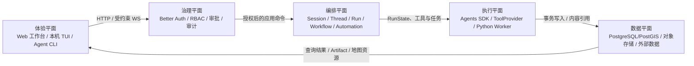

# GeoForge 架构总览

GeoForge 是一个中文优先的地理与气象智能平台。仓库采用 npm/Python 混合 monorepo：用户体验、Agent 编排、科学计算、结构化事实和本机运维具有独立所有者，通过严格契约连接。

## 仓库布局

```text
apps/
  server/       Node.js API、WebSocket、Agent 编排与治理
  web/          React + MapLibre 工作台
  worker/       FastAPI 科学计算边界
packages/
  shared-types/ 跨进程 Zod 契约
  gis-meteorology/  地理与气象领域算法
  operations-supervisor/ TypeScript 进程监督器
infra/          PostgreSQL/PostGIS migration、种子与 Compose
deploy/         systemd、WinSW 和生产环境模板
scripts/        开发、校验、部署与数据维护脚本
tests/          跨应用端到端测试
docs/           架构、运维、标准、评审与汇报材料
vendor/         保留来源与许可证的第三方代码
```

应用统一位于 `apps/`，可复用能力统一位于 `packages/`。任何运行时不得通过扫描目录猜测插件、服务或工具；扩展必须经过显式注册、schema 和能力清单。

## 能力平面



依赖方向固定为：体验层调用应用服务，应用服务编排领域能力，领域能力通过 Port 使用基础设施。基础设施不得反向决定业务规则；UI、缓存和文件投影不得反向成为平台事实源。

## 权威事实

| 事实 | 唯一事实源 |
|---|---|
| 用户、工作区、RBAC、Session、Thread、Run、Transcript、Workflow、Approval、Audit | PostgreSQL/PostGIS |
| 上传内容、Artifact 二进制、SDK checkpoint 载荷、Markdown 记忆正文 | 内容寻址对象存储；数据库保存引用与生命周期 |
| 浏览器实时 run、timeline、连接与工作区状态 | Zustand |
| HTTP 可重取查询缓存 | TanStack Query |
| 服务进程、健康、重启预算、指标和日志 | TypeScript operations supervisor 的内存状态与真实进程句柄 |

`runtime/` 是部署配置决定的运行目录，不是源码模块，也不是 Session/Run 的第二事实源。旧文件会话格式不做静默扫描兼容。

## 主要运行链路

### Web 与 API

1. `apps/web` 通过 HTTP 获取认证、文件、地图和分页查询，通过统一 WebSocket transport 执行实时业务命令。
2. `apps/server` 在 HTTP upgrade 阶段验证 Origin 和 Better Auth session，再由命令 registry 执行 Zod、CSRF、RBAC 和限速。
3. 路由与 WS handler 只适配协议；资源写入由应用服务和按资源拆分的 PostgreSQL Store 负责。

### Agent

1. 用户消息进入 canonical Thread/Run。
2. `@openai/agents` Runner 是单次运行的编排状态机，RunState 是审批中断和恢复载荷。
3. GeoForge 负责工作流、权限、工具注册、`valueRef`、数据库事实、审计与分层记忆。
4. DeepSeek 使用专属 OpenAI-compatible Chat Completions Model 适配器；Provider descriptor 限定可选模型和真实能力。
5. ToolProvider 经过 manifest/schema 一致性校验后才可注册。Python 工具契约以 Pydantic catalog 为事实源。

### 科学计算

`apps/worker` 只处理 FastAPI 路由、中间件、HMAC 和路径沙箱；领域算法位于 `packages/gis-meteorology`。Worker 无权持有 Session/Thread/Run 状态，只接受 `RUNTIME_ROOT` 内经过验证的相对对象引用。

### 本机运维

`packages/operations-supervisor` 监督固定的 `infra`、`worker`、`api`、`web` 服务。`concurrently` 仅作为子进程执行适配器。运维 TUI 和 Agent CLI 是本机人工入口，不是网页终端、Shell、Agent Tool 或 Automation 动作。

## 关键边界

- 所有 HTTP、WS、Worker、数据库、文件和模型输出都在进入内部逻辑前经过 schema。
- 公共成员接口只能授予工作区角色；`platform_admin` 使用独立保护边界。
- 本机保留主体不能公开登录。Agent 主体仅在 TCP 对端被证明为 loopback 后可进入 WS。
- 开发者文件工具无条件拒绝 `.env*`、私钥、令牌、密钥和整个运维密钥目录。
- schema 漂移、权限失败、工具失败、对象写入失败和 Worker 失败必须硬失败，不得伪造成功。

## 架构验证

核心结构守卫位于：

- `apps/server/src/architecture.test.ts`
- `apps/web/src/__tests__/architecture.test.ts`
- `packages/operations-supervisor/src/*.test.ts`
- `apps/worker/tests/scan_security.py`

目录迁移、扩展点或事实源变更必须同时更新守卫，并至少证明依赖方向、失败路径和真实运行链路。
