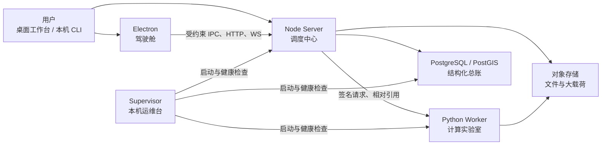

# GeoForge 架构设计说明：为什么要这样拆

日期：2026-07-30  
面向读者：参与 GeoForge 开发、集成或评审的技术人员  
分析基线：仓库提交 `64d0dc72`

## 分析范围

本报告依据当前仓库的入口代码、模块目录、协议契约、架构测试和运维文档进行静态分析，重点解释设计动机与取舍。它不包含生产负载测试、真实故障统计或团队访谈，因此不评价实际吞吐量，也不推断尚未写入代码和文档的历史决策。

## 一句话结论

GeoForge 的架构目标不是把所有能力塞进一个桌面程序，而是让**界面、任务调度、科学计算、数据保存和本机运维各管一件事**。这会增加一些模块和契约，但换来的是：某一部分出错时更容易定位，新增工具时不必修改整条主链路，桌面端和 CLI 也不会各自形成一套互相矛盾的系统。

如果用一个容易记住的比喻：

- Electron 桌面端是**驾驶舱**，负责交互和展示；
- Node Server 是**调度中心**，负责权限、任务、Agent 和工具编排；
- Python Worker 是**计算实验室**，负责气象与空间算法；
- PostgreSQL/PostGIS 是**总账本**，记录平台真实状态；
- 内容寻址对象存储是**大件仓库**，保存文件和二进制产物；
- Operations Supervisor 是**本机运维台**，负责服务启动、健康检查、日志和重启。

## 1. 它本质上是什么系统

GeoForge 不是一个普通地图查看器，也不是给大模型套一层聊天框。它同时处理五类问题：

1. 用户在地图、图层和对话界面里发出意图；
2. Agent 把意图拆成可执行步骤；
3. 工具读取气象文件、空间边界或数据库数据；
4. 计算结果要变成图层、表格、报告或 Artifact；
5. 整个过程需要可恢复、可追踪，并且能在 Windows 本机稳定运行。

这几类问题的技术特点差别很大。如果全部放在 Electron 或单个后端里，短期看起来简单，后期会出现三个典型问题：

- UI 为了完成一个功能直接碰数据库、文件路径和认证信息；
- Python 算法开始保存会话状态，Node 又保存一份，出现“两边都说自己是真的”；
- 新增一个工具要修改多个中央 `switch`，最终没人敢动核心文件。

因此，当前设计围绕一个原则展开：**把容易变化的能力分开，把必须一致的事实集中起来。**

## 2. 总体结构

这张图最重要的不是箭头数量，而是箭头方向：

- Renderer 不直接访问数据库、认证令牌或本机绝对路径；
- Worker 不拥有 Session、Thread、Run；
- UI 缓存不反向成为后端事实；
- Supervisor 能观察和恢复服务，但不参与 Agent 业务判断。

## 3. 为什么桌面端还要分 Main、Preload 和 Renderer

Electron 同时具备浏览器能力和本机能力。如果 Renderer 既能渲染网页，又能任意访问文件、网络和系统 API，一次界面漏洞就可能扩大为本机权限问题。

GeoForge 因此把桌面端拆为三层：

- **Main**：持有认证、HTTP/WS、文件选择、下载导出、窗口和权限；
- **Preload**：只暴露固定 IPC，并用 Zod 校验输入输出；
- **Renderer**：负责 React、MapLibre、Zustand 和界面交互。

这样设计还有一个不那么明显的好处：Renderer 可以把注意力放在地图和交互上，不需要知道 Cookie 放在哪里、文件的绝对路径是什么、WebSocket 怎样重连。

代价也很直接：增加一个桌面能力时，往往需要同时补 IPC 契约、Main 实现和 Renderer 调用。对小工具来说显得重，但对一个长期运行、会接触用户文件和平台账号的桌面 GIS 来说，这条边界值得保留。

## 4. 为什么 Node 负责编排，Python 只负责科学计算

项目没有选择“所有后端都用 Python”，也没有强行把科学算法改写成 TypeScript。原因是两种语言各自擅长的事情不同：

- Node/TypeScript 更适合管理 WebSocket、类型契约、Agent 状态机、权限和桌面通信；
- Python 更适合使用 numpy、xarray、rasterio、geopandas 等科学计算生态。

因此 Node 负责回答“谁可以在什么时候调用哪个工具”，Python 负责回答“这个气象或空间计算怎样完成”。

Worker 被刻意设计成无状态计算边界：

- 工具通过注册表显式加入；
- Pydantic request/response model 生成工具 catalog；
- Node 校验 catalog 与 Provider 契约是否一致；
- Worker 只接收 `RUNTIME_ROOT` 内经过校验的相对引用；
- 计算算法放在 `packages/gis-meteorology`，FastAPI 层只负责路由、中间件和分发。

这样新增一个算法时，通常是新增工具实现并注册，不需要把 Session、审批或 UI 逻辑复制到 Python。

## 5. 为什么 PostgreSQL 和对象存储要分开

平台中的数据大致分为两类：

- **需要查询和关联的事实**：用户、工作区、Thread、Run、审批、图层元数据、工具目录；
- **体积较大的内容**：上传文件、GeoTIFF、报告、Artifact 二进制、SDK checkpoint 正文。

全部放数据库会让大文件读写和备份变重；全部放 JSON 文件又很难保证事务、查询和并发一致性。所以 GeoForge 采用“账本 + 仓库”的组合：

- PostgreSQL/PostGIS 记录“有什么、属于谁、当前状态是什么”；
- 内容寻址对象存储保存“具体内容是什么”；
- 数据库保存对象引用、摘要和生命周期。

这里真正重要的是**唯一事实源**。例如一个 Run 的状态只由数据库决定，Renderer 的 Zustand 只是实时投影；重启后可以重新加载，而不能拿 UI 内存反写成平台事实。

这项设计解决了最难排查的一类问题：界面显示完成、磁盘 JSON 显示运行中、数据库又显示失败。只允许一个总账本后，其他状态都能解释为缓存、投影或载荷。

## 6. 为什么同时使用 HTTP 和 WebSocket

两种协议承担的任务不同：

- HTTP 适合上传、下载、健康检查、可分页查询和一次性资源请求；
- WebSocket 适合创建 Run、控制 Agent、订阅状态、接收流式事件和审批。

GeoForge 没有让每个开发者自由决定协议，而是把实时控制命令统一放进 WS registry。每条命令把 payload schema、认证要求、授权策略和 handler 绑在一起。

这么做不是为了“多一道门禁”，而是为了避免三件事：

1. 新命令忘记校验参数；
2. 新命令有 handler 却没有授权规则；
3. 一个巨大 `switch` 同时处理所有业务。

当命令数量增长时，注册表比中央分支更容易扩展和测试。

## 7. 为什么 Agent Runtime 必须放在服务端

桌面 Chat 和本机 Agent CLI 都能发起任务，但它们不各自运行一套 Agent。真正的 Runner、RunState、审批、checkpoint、工具执行和会话事实都在主 API 中。

原因很现实：

- 用户从桌面发起任务后，CLI 仍可以查看同一个 Run；
- 客户端断线不会让任务事实消失；
- 审批和恢复只需要实现一次；
- 模型、工具和审计策略不会因客户端不同而分叉。

`@openai/agents` Runner 负责单次运行的状态推进，GeoForge 在外层负责平台自己的 Thread、Run、审批和持久化。两者不是重复状态机：前者解决一次 Agent 执行，后者解决平台如何保存、恢复和展示这次执行。

Desktop 与 CLI 还共享 `conversation-presentation`，统一消息分类、工具调用与结果配对。两端只保留不同的最终渲染方式：桌面使用 DOM，CLI 使用终端 Markdown。

## 8. `valueRef` 为什么是关键设计

GIS 和气象工具经常产生很大的 GeoJSON、栅格元数据或文件集合。如果每一步都要求模型复制上一工具的完整结果，会带来三个问题：

- 上下文迅速膨胀；
- 模型可能抄错坐标、字段或路径；
- 工具链很难证明输入确实来自上一步。

`valueRef` 相当于运行内的受控句柄。工具输出真实数据后，后续工具传引用 ID，而不是重新拼一份数据。它让工具链更像数据管道，而不是让模型在多轮文本里搬运大型对象。

这是 GeoForge 区别于普通“聊天调用函数”的重要地方：模型负责选择和组织，数据尽量沿确定性引用流动。

## 9. 为什么扩展点采用注册表和 schema

GeoForge 的长期目标是继续加入地图 source、渲染样式、ToolProvider、Worker 工具和 Automation。如果每加一种能力都修改核心分支，核心模块会越来越不稳定。

当前主要扩展方式是：

- WS 命令通过 command registry 注册；
- Agent 工具通过 ToolProvider manifest 和 registry 注册；
- Worker 工具通过 Pydantic model 和 registry 注册；
- 地图 source/style 通过 Renderer registry 注册；
- Automation 通过定义、编译和运行边界接入。

这类设计前期文件较多，但新增能力时更接近“增加实现并登记”，而不是“找到五个 `switch` 分别加一段”。

## 10. 为什么还需要独立 Supervisor

桌面程序不应该同时充当数据库、Worker 和 API 的进程管理器。否则窗口关闭、界面卡死或 Electron 升级时，后台服务的状态也会变得不可靠。

Supervisor 只管理三个固定服务：

1. `infra`：PostgreSQL/PostGIS；
2. `worker`：Python 科学计算；
3. `api`：Node API、WebSocket 和 Agent Runtime。

它知道依赖顺序、真实进程句柄、端口冲突、健康状态、重启预算和日志。Electron 不进入这套状态机，所以即使 API 或数据库故障，桌面仍可以打开本机日志查看原因。

这使系统更像一个可运维的本机平台，而不是一组靠开发者手工开终端维持的脚本。

## 11. 哪些边界必须保留，哪些门禁可以继续简化

项目确实存在“边界多、测试多、门禁多”的体感。不能简单地把所有门禁都视为同等重要。

### 建议保留的核心边界

- 外部输入进入 HTTP、WS、IPC、Worker 前的 schema 校验；
- Renderer 不持有认证令牌和本机绝对路径；
- PostgreSQL 作为结构化事实源；
- Worker 路径沙箱和 HMAC 请求完整性；
- ToolProvider、Worker catalog 与实际 schema 一致；
- Agent 审批、checkpoint 和工具副作用状态真实落盘；
- Supervisor 只承认自己持有的真实进程，不把端口占用当成服务正常。

这些边界一旦删除，问题通常不是“开发快一点”，而是错误会变得不可解释。

### 可以继续审视和合并的部分

- 同一字段在 IPC、共享协议和业务模块中被重复校验时，可考虑集中到一个权威 schema；
- 只检查文件位置、命名或源码字符串的架构测试，应确认它是否真的保护依赖方向；
- `PlatformPersistenceFacade` 暴露的方法很多，虽然内部已经按资源拆分，但调用面仍可能继续缩窄；
- `AppContainer` 和桌面 `WorkspaceLayout` 是合理的组合层，但继续加职责会重新变成大入口；
- UI 权限判断、菜单可见性和服务端授权要分工清楚，避免三个位置重复表达同一政策。

判断一条门禁是否值得保留，可以问三个问题：

1. 它保护的是数据、权限或不可恢复副作用吗？
2. 删除后，错误能否在更靠近事实源的位置被同样清楚地发现？
3. 它是否只是检查代码长什么样，而不是检查系统行为？

前两项答案为“是”的门禁通常应保留；只满足第三项的门禁更适合简化。

## 12. 这套架构的主要代价

这套设计适合可扩展平台，但不是没有成本：

- 开发者需要理解多个进程和多种契约；
- 一个跨层功能可能同时修改 Desktop、Server、Worker 和 shared-types；
- 本机启动依赖 Node、Python 和 PostgreSQL/PostGIS；
- schema 与架构测试如果维护不当，会从保护边界变成阻碍重构；
- 组合根和 Facade 仍有继续膨胀的风险。

所以它不适合做一个只有两三个页面的轻量 Demo。它的合理性建立在一个前提上：GeoForge 会继续增加工具、工作流、图层类型、客户端入口和科学计算能力。

## 13. 总体判断

GeoForge 当前采用的是“平台型本机桌面架构”，而不是传统网站架构。最合理的三个决定是：

1. 结构化事实只认 PostgreSQL/PostGIS；
2. Agent 编排与 Python 科学计算分开；
3. Desktop 和 CLI 共用服务端 Runtime 与对话投影。

最大的长期风险不是安全不足，而是**边界数量继续增长后出现重复表达**。后续优化重点不应是把所有校验删除，而应是让每条规则只在最合适的位置存在一次，并通过真正的失败路径测试证明它有价值。

换句话说，下一阶段应追求的不是“更多门禁”，也不是“没有门禁”，而是：

> 关键边界足够硬，普通扩展足够轻。

## 14. 给技术人员讲解时的五分钟版本

可以按下面顺序讲：

1. **先讲定位**：这是一个能持续执行 GIS/气象任务的桌面 Agent 平台，不只是地图或聊天框。
2. **再讲六个角色**：桌面是驾驶舱，Node 是调度中心，Python 是计算实验室，数据库是账本，对象存储是仓库，Supervisor 是运维台。
3. **强调唯一事实源**：Run、Thread 和审批只认数据库，UI 和文件只是投影或载荷。
4. **解释扩展方式**：新工具通过 Provider、registry 和 schema 接入，避免修改中央大分支。
5. **主动承认代价**：层次和契约较多；下一步要做的是合并重复门禁，而不是破坏核心边界。

## 15. 主要证据位置

| 结论 | 代码或文档证据 |
|---|---|
| 总体能力平面与事实源 | [`docs/architecture/overview.md`](../architecture/overview.md) |
| Server 启动、HTTP/WS 和生命周期 | [`apps/server/src/main.ts`](../../apps/server/src/main.ts)、[`lifecycle.ts`](../../apps/server/src/lifecycle.ts) |
| 应用依赖装配 | [`apps/server/src/app/container.ts`](../../apps/server/src/app/container.ts) |
| WS 注册与授权绑定 | [`apps/server/src/ws/commandRegistry.ts`](../../apps/server/src/ws/commandRegistry.ts) |
| Agent、审批和 checkpoint | [`apps/server/src/agent/runtime.ts`](../../apps/server/src/agent/runtime.ts)、[`agentsCheckpointService.ts`](../../apps/server/src/agent/agentsCheckpointService.ts) |
| `valueRef` 持久化 | [`apps/server/src/tools/resultPersistence.ts`](../../apps/server/src/tools/resultPersistence.ts) |
| PostgreSQL 与载荷存储组合 | [`apps/server/src/store/platformPersistenceFacade.ts`](../../apps/server/src/store/platformPersistenceFacade.ts) |
| Electron Main 组合根 | [`apps/desktop/src/main/index.ts`](../../apps/desktop/src/main/index.ts) |
| Preload 与 IPC 契约 | [`apps/desktop/src/preload/index.ts`](../../apps/desktop/src/preload/index.ts)、[`desktopIpc.ts`](../../apps/desktop/src/contracts/desktopIpc.ts) |
| Worker 无状态装配与工具 catalog | [`apps/worker/src/worker_app/app_factory.py`](../../apps/worker/src/worker_app/app_factory.py)、[`tool_registry.py`](../../apps/worker/src/worker_app/tool_registry.py) |
| 本机服务依赖与运维边界 | [`packages/operations-supervisor/src/catalog.ts`](../../packages/operations-supervisor/src/catalog.ts)、[`operations-console.md`](../operations/operations-console.md) |
| 架构边界测试 | [`apps/server/src/architecture.test.ts`](../../apps/server/src/architecture.test.ts)、[`apps/desktop/src/renderer/__tests__/architecture.test.ts`](../../apps/desktop/src/renderer/__tests__/architecture.test.ts) |

## 论点—证据核对

| 主要论点 | 证据状态 |
|---|---|
| 系统按体验、编排、执行、数据和运维职责拆分 | 已由目录、入口代码和架构文档支持 |
| PostgreSQL 是结构化事实源，对象存储保存大载荷 | 已由存储门面、仓储目录和架构测试支持 |
| Desktop Renderer 不直接持有网络、认证和文件边界 | 已由 Main、Preload、IPC 契约及架构测试支持 |
| Worker 是无状态科学计算边界 | 已由 Worker app factory、tool registry 和路径沙箱支持 |
| 注册表设计用于降低新增能力对核心分支的修改 | 已由 WS、ToolProvider、Worker 和地图 registry 支持 |
| 部分门禁未来可以合并 | 属于基于当前重复校验面与组合层规模作出的工程判断 |
